# Bridge Crane Inspection App - Comprehensive Architecture Plan

## Architecture Overview

The Bridge Crane Inspection App will be built using a **Tauri (Rust) + Svelte + SQLite** stack with AI integration capabilities. The architecture prioritizes data integrity, compliance management, and seamless AI model integration.

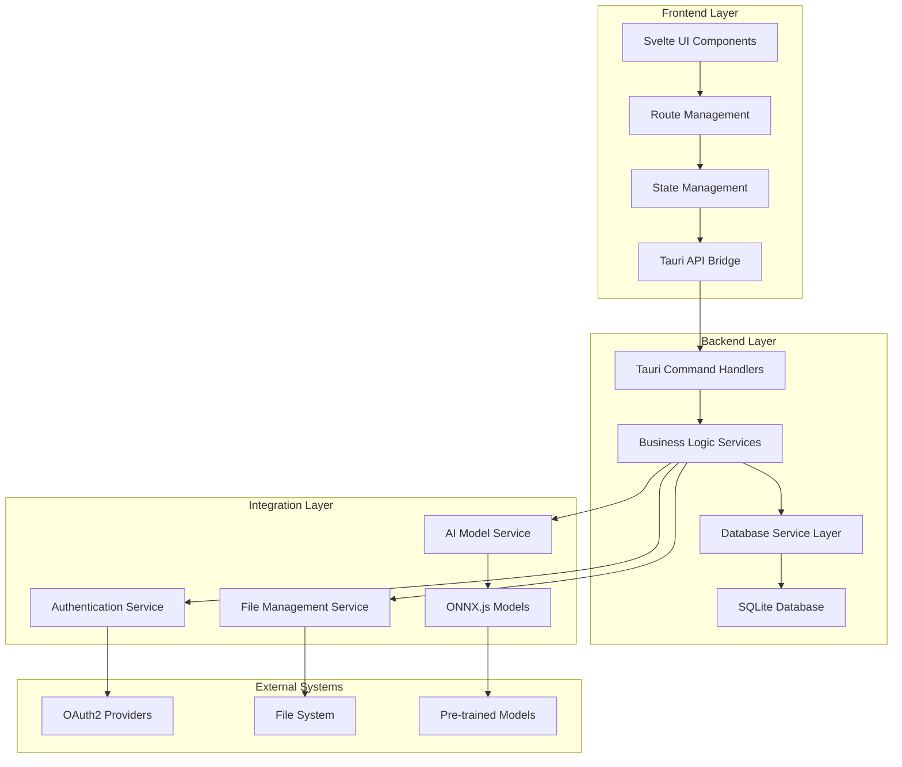

## 1. Database Schema Design (Priority 1)

### Core Entity Relationships

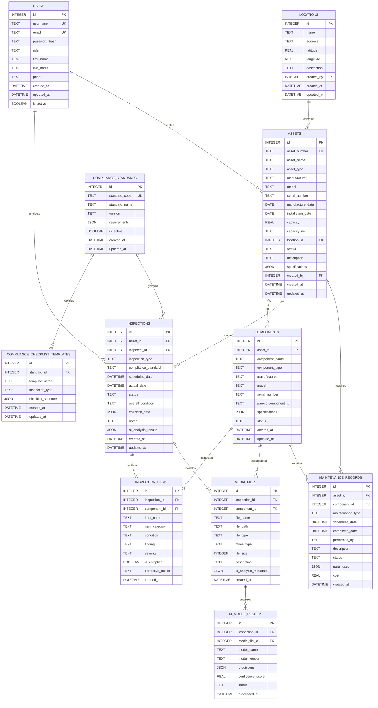

### Key Schema Features

**Compliance-First Design**: Tables are structured to directly support OSHA 1910.179 and ASME B30.2 requirements with flexible JSON fields for additional standards.

**AI Integration Ready**: Built-in support for AI model results, media analysis, and predictive maintenance data.

**Audit Trail**: All major entities include created_at, updated_at, and created_by fields for compliance tracking.

**Flexible Specifications**: JSON fields allow for varying asset and component specifications without schema changes.

## 2. Backend Architecture (Priority 1)

### Rust Backend Structure

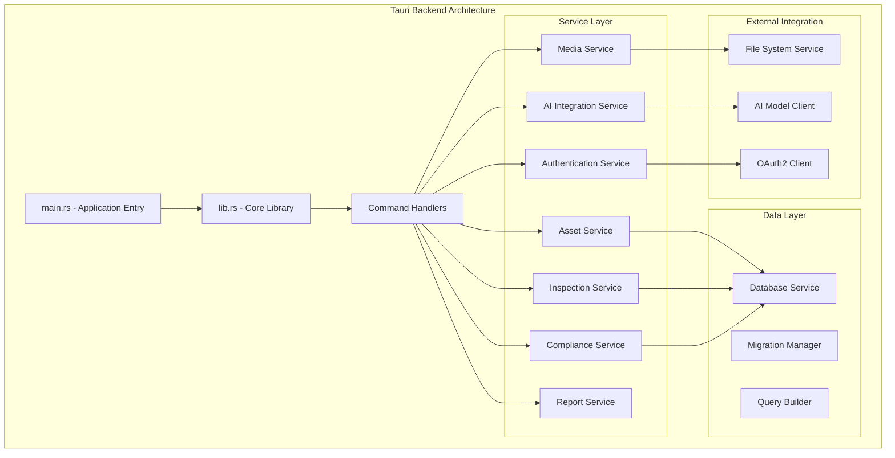

### Core Backend Components

#### 1. Database Service Layer (`src/services/database/`)

```rust
// Key Rust dependencies to add to Cargo.toml
[dependencies]
rusqlite = { version = "0.29", features = ["bundled", "chrono", "serde_json"] }
tokio = { version = "1.0", features = ["full"] }
serde = { version = "1.0", features = ["derive"] }
serde_json = "1.0"
chrono = { version = "0.4", features = ["serde"] }
uuid = { version = "1.0", features = ["v4"] }
bcrypt = "0.15"
jsonwebtoken = "9"
reqwest = { version = "0.11", features = ["json"] }
tauri-plugin-fs = "2"
tauri-plugin-dialog = "2"
```

#### 2. Tauri Command Structure

**Asset Management Commands:**
- `create_asset()`
- `update_asset()`
- `get_assets()`
- `delete_asset()`
- `get_asset_components()`

**Inspection Commands:**
- `create_inspection()`
- `update_inspection()`
- `get_inspections()`
- `submit_inspection()`
- `get_compliance_checklist()`

**AI Integration Commands:**
- `analyze_image()`
- `detect_defects()`
- `predict_maintenance()`
- `get_ai_insights()`

#### 3. Authentication & Security Architecture

**OAuth2 Integration:**
- Support for multiple providers (Google, Microsoft, custom)
- JWT token management with secure storage via `tauri-plugin-stronghold`
- Role-based access control (Inspector, Supervisor, Administrator)

**Security Features:**
- Encrypted credential storage
- Session management
- API rate limiting
- Audit logging

## 3. AI Model Integration & ONNX.js Implementation Details

### AI Architecture Overview

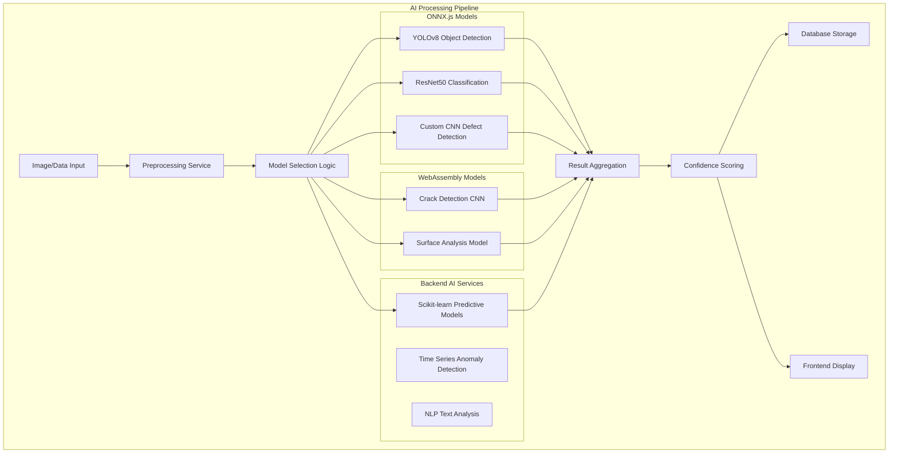

### ONNX.js Implementation Details

#### Model Loading and Management

```javascript
// Frontend AI Service Implementation
class AIModelService {
    constructor() {
        this.models = new Map();
        this.modelConfigs = {
            yolov8: {
                path: '/models/yolov8_crane_detection.onnx',
                inputShape: [1, 3, 640, 640],
                confidence: 0.5,
                iouThreshold: 0.45
            },
            resnet50: {
                path: '/models/resnet50_defect_classification.onnx',
                inputShape: [1, 3, 224, 224],
                confidence: 0.7
            },
            defect_cnn: {
                path: '/models/custom_defect_detection.onnx',
                inputShape: [1, 1, 256, 256],
                confidence: 0.6
            }
        };
    }

    async loadModel(modelName) {
        if (this.models.has(modelName)) {
            return this.models.get(modelName);
        }

        const config = this.modelConfigs[modelName];
        const session = await ort.InferenceSession.create(config.path, {
            executionProviders: ['webgl', 'wasm']
        });
        
        this.models.set(modelName, { session, config });
        return this.models.get(modelName);
    }

    async preprocessImage(imageData, targetShape) {
        // Image preprocessing for different model requirements
        const canvas = document.createElement('canvas');
        const ctx = canvas.getContext('2d');
        
        canvas.width = targetShape[3];
        canvas.height = targetShape[2];
        
        // Resize and normalize image
        ctx.drawImage(imageData, 0, 0, canvas.width, canvas.height);
        const imageBuffer = ctx.getImageData(0, 0, canvas.width, canvas.height);
        
        // Convert to tensor format expected by model
        const tensor = this.imageToTensor(imageBuffer, targetShape);
        return tensor;
    }

    async detectObjects(imageData) {
        const model = await this.loadModel('yolov8');
        const inputTensor = await this.preprocessImage(imageData, model.config.inputShape);
        
        const feeds = { input: inputTensor };
        const results = await model.session.run(feeds);
        
        return this.postprocessYOLO(results, model.config);
    }

    async classifyDefects(imageData) {
        const model = await this.loadModel('resnet50');
        const inputTensor = await this.preprocessImage(imageData, model.config.inputShape);
        
        const feeds = { input: inputTensor };
        const results = await model.session.run(feeds);
        
        return this.postprocessClassification(results, model.config);
    }
}
```

#### Model Performance Optimization

```javascript
// Performance optimization strategies
class ModelOptimizer {
    constructor() {
        this.modelCache = new Map();
        this.inferenceQueue = [];
        this.isProcessing = false;
    }

    async batchInference(requests) {
        // Batch multiple inference requests for efficiency
        const batches = this.createBatches(requests, 4);
        const results = [];
        
        for (const batch of batches) {
            const batchResults = await Promise.all(
                batch.map(req => this.runInference(req))
            );
            results.push(...batchResults);
        }
        
        return results;
    }

    async warmupModels() {
        // Pre-load and warm up models during app initialization
        const warmupPromises = Object.keys(this.modelConfigs).map(async (modelName) => {
            const model = await this.loadModel(modelName);
            // Run dummy inference to warm up WebGL/WASM
            const dummyInput = this.createDummyInput(model.config.inputShape);
            await model.session.run({ input: dummyInput });
        });
        
        await Promise.all(warmupPromises);
    }
}
```

## 4. Compliance Checklist Structure & Validation Logic

### Compliance Framework Architecture

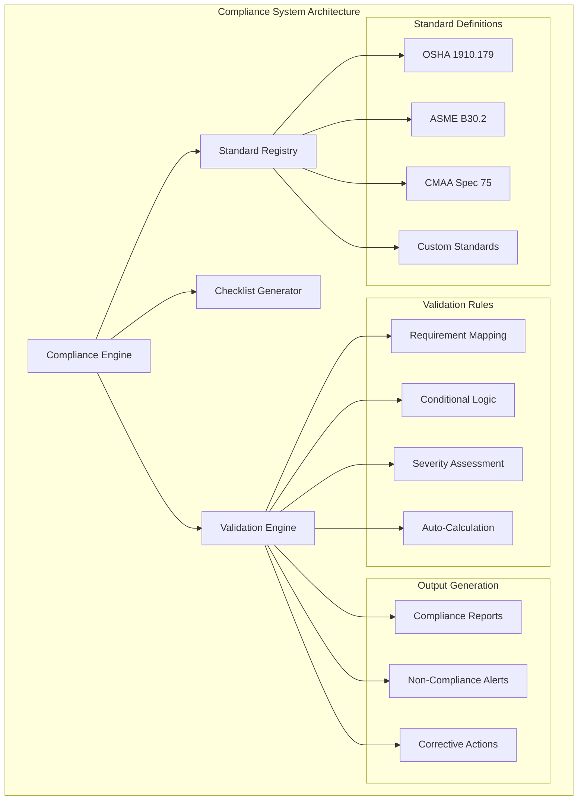

### OSHA 1910.179 Compliance Structure

```json
{
  "standard_code": "OSHA_1910_179",
  "standard_name": "Overhead and Gantry Cranes",
  "version": "2023",
  "inspection_types": {
    "frequent": {
      "frequency": "daily_to_monthly",
      "requirements": {
        "hoisting_mechanism": {
          "items": [
            {
              "id": "hoist_001",
              "description": "All functional operating mechanisms for maladjustment",
              "check_method": "visual_operational",
              "severity_levels": ["minor", "major", "critical"],
              "validation_rules": {
                "condition": "required",
                "photographic_evidence": "recommended",
                "corrective_action_required": ["major", "critical"]
              }
            },
            {
              "id": "hoist_002", 
              "description": "Deterioration or leakage in lines, tanks, valves, drain pumps, and other parts",
              "check_method": "visual_inspection",
              "ai_detection_capable": true,
              "ai_models": ["defect_detection", "leak_detection"]
            }
          ]
        },
        "runway_tracks": {
          "items": [
            {
              "id": "runway_001",
              "description": "Crane runway and approach distances",
              "check_method": "measurement",
              "validation_rules": {
                "min_clearance": "3_feet",
                "measurement_required": true,
                "tolerance": "±2_inches"
              }
            }
          ]
        }
      }
    },
    "periodic": {
      "frequency": "monthly_to_yearly",
      "requirements": {
        "structural_components": {
          "items": [
            {
              "id": "struct_001",
              "description": "Deformed, cracked, or corroded members in crane structure",
              "check_method": "detailed_visual_ndt",
              "ai_detection_capable": true,
              "ai_models": ["crack_detection", "corrosion_analysis"],
              "validation_rules": {
                "ndt_required_if": "visual_indication_present",
                "engineer_review_required": ["structural_damage"]
              }
            }
          ]
        }
      }
    }
  }
}
```

### ASME B30.2 Compliance Structure

```json
{
  "standard_code": "ASME_B30_2",
  "standard_name": "Overhead and Gantry Cranes (Top Running Bridge, Single or Multiple Girder, Top Running Trolley Hoist)",
  "version": "2023",
  "inspection_categories": {
    "initial": {
      "description": "Before initial use, all new, extensively repaired, or altered cranes",
      "requirements": {
        "load_test": {
          "test_load": "125_percent_rated_capacity",
          "duration": "minimum_10_minutes",
          "validation_rules": {
            "certified_operator_required": true,
            "documentation_required": true,
            "photo_evidence_required": true
              }
        }
      }
    },
    "frequent": {
      "frequency_options": ["daily", "weekly", "monthly"],
      "requirements": {
        "operational_tests": {
          "items": [
            {
              "id": "op_001",
              "description": "Hoisting and lowering",
              "validation_rules": {
                "load_test_percentage": "normal_operating_load",
                "performance_criteria": {
                  "smooth_operation": true,
                  "no_unusual_noise": true,
                  "proper_brake_function": true
                }
              }
            }
          ]
        }
      }
    }
  }
}
```

### Validation Engine Implementation

```rust
// Rust backend compliance validation service
use serde::{Deserialize, Serialize};
use std::collections::HashMap;

#[derive(Debug, Serialize, Deserialize)]
pub struct ComplianceValidationResult {
    pub is_compliant: bool,
    pub compliance_score: f32,
    pub violations: Vec<ComplianceViolation>,
    pub recommendations: Vec<String>,
    pub next_inspection_due: chrono::DateTime<chrono::Utc>,
}

#[derive(Debug, Serialize, Deserialize)]
pub struct ComplianceViolation {
    pub item_id: String,
    pub severity: ViolationSeverity,
    pub description: String,
    pub corrective_action: String,
    pub deadline: Option<chrono::DateTime<chrono::Utc>>,
}

pub struct ComplianceValidator {
    standards: HashMap<String, ComplianceStandard>,
    validation_rules: HashMap<String, ValidationRule>,
}

impl ComplianceValidator {
    pub fn validate_inspection(&self, inspection: &Inspection) -> ComplianceValidationResult {
        let standard = self.standards.get(&inspection.compliance_standard)
            .expect("Unknown compliance standard");
            
        let mut violations = Vec::new();
        let mut compliance_score = 100.0;
        
        // Validate each inspection item against standard requirements
        for item in &inspection.items {
            if let Some(requirement) = standard.get_requirement(&item.item_id) {
                let validation_result = self.validate_item(item, requirement);
                
                if !validation_result.is_compliant {
                    violations.extend(validation_result.violations);
                    compliance_score -= validation_result.score_impact;
                }
            }
        }
        
        // Calculate next inspection due date based on standard requirements
        let next_inspection_due = self.calculate_next_inspection_date(
            &inspection.compliance_standard,
            &inspection.inspection_type,
            inspection.actual_date
        );
        
        ComplianceValidationResult {
            is_compliant: violations.is_empty(),
            compliance_score: compliance_score.max(0.0),
            violations,
            recommendations: self.generate_recommendations(&violations),
            next_inspection_due,
        }
    }
    
    fn validate_item(&self, item: &InspectionItem, requirement: &ComplianceRequirement) -> ItemValidationResult {
        let mut violations = Vec::new();
        
        // Check required fields
        if requirement.condition_required && item.condition.is_empty() {
            violations.push(ComplianceViolation {
                item_id: item.item_id.clone(),
                severity: ViolationSeverity::Major,
                description: "Condition assessment required".to_string(),
                corrective_action: "Complete condition assessment".to_string(),
                deadline: Some(chrono::Utc::now() + chrono::Duration::days(7)),
            });
        }
        
        // Validate condition against severity thresholds
        if let Some(condition_rules) = &requirement.condition_validation {
            if !self.validate_condition(&item.condition, condition_rules) {
                violations.push(ComplianceViolation {
                    item_id: item.item_id.clone(),
                    severity: self.determine_severity(&item.condition),
                    description: format!("Condition '{}' does not meet standard requirements", item.condition),
                    corrective_action: "Address identified deficiency".to_string(),
                    deadline: self.calculate_correction_deadline(&item.severity),
                });
            }
        }
        
        ItemValidationResult {
            is_compliant: violations.is_empty(),
            violations,
            score_impact: self.calculate_score_impact(&violations),
        }
    }
}
```

## 5. File Handling & Media Management Architecture

### Media Management System

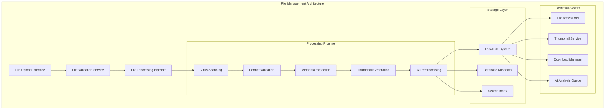

### File System Service Implementation

```rust
// Rust file management service
use tauri_plugin_fs;
use std::path::{Path, PathBuf};
use uuid::Uuid;
use image::{ImageFormat, DynamicImage};

#[derive(Debug, Serialize, Deserialize)]
pub struct MediaFile {
    pub id: String,
    pub original_name: String,
    pub file_path: String,
    pub file_type: MediaType,
    pub mime_type: String,
    pub file_size: u64,
    pub checksum: String,
    pub metadata: FileMetadata,
    pub thumbnails: Vec<ThumbnailInfo>,
    pub ai_analysis_status: AnalysisStatus,
}

pub struct FileManagementService {
    base_path: PathBuf,
    max_file_size: u64,
    allowed_types: Vec<String>,
    thumbnail_sizes: Vec<(u32, u32)>,
}

impl FileManagementService {
    pub async fn save_inspection_media(
        &self,
        file_data: &[u8],
        original_name: &str,
        inspection_id: i64,
    ) -> Result<MediaFile, FileError> {
        // Generate unique filename
        let file_id = Uuid::new_v4().to_string();
        let extension = Path::new(original_name)
            .extension()
            .and_then(|e| e.to_str())
            .ok_or(FileError::InvalidExtension)?;
        
        let filename = format!("{}.{}", file_id, extension);
        let file_path = self.get_inspection_path(inspection_id).join(&filename);
        
        // Validate file
        self.validate_file(file_data, &filename)?;
        
        // Save file to disk
        tokio::fs::create_dir_all(file_path.parent().unwrap()).await?;
        tokio::fs::write(&file_path, file_data).await?;
        
        // Extract metadata
        let metadata = self.extract_metadata(file_data, &filename).await?;
        
        // Generate thumbnails for images
        let thumbnails = if self.is_image(&filename) {
            self.generate_thumbnails(&file_path).await?
        } else {
            Vec::new()
        };
        
        // Calculate checksum
        let checksum = self.calculate_checksum(file_data);
        
        // Create database record
        let media_file = MediaFile {
            id: file_id,
            original_name: original_name.to_string(),
            file_path: file_path.to_string_lossy().to_string(),
            file_type: self.determine_file_type(&filename),
            mime_type: self.get_mime_type(&filename),
            file_size: file_data.len() as u64,
            checksum,
            metadata,
            thumbnails,
            ai_analysis_status: AnalysisStatus::Pending,
        };
        
        // Queue for AI analysis if applicable
        if self.should_analyze_with_ai(&media_file) {
            self.queue_ai_analysis(&media_file).await?;
        }
        
        Ok(media_file)
    }
    
    async fn generate_thumbnails(&self, file_path: &Path) -> Result<Vec<ThumbnailInfo>, FileError> {
        let image = image::open(file_path)?;
        let mut thumbnails = Vec::new();
        
        for (width, height) in &self.thumbnail_sizes {
            let thumbnail = image.resize(*width, *height, image::imageops::FilterType::Lanczos3);
            
            let thumb_filename = format!(
                "thumb_{}x{}_{}", 
                width, 
                height, 
                file_path.file_name().unwrap().to_string_lossy()
            );
            
            let thumb_path = file_path.parent().unwrap().join(&thumb_filename);
            thumbnail.save(&thumb_path)?;
            
            thumbnails.push(ThumbnailInfo {
                width: *width,
                height: *height,
                file_path: thumb_path.to_string_lossy().to_string(),
                file_size: std::fs::metadata(&thumb_path)?.len(),
            });
        }
        
        Ok(thumbnails)
    }
    
    async fn extract_metadata(&self, file_data: &[u8], filename: &str) -> Result<FileMetadata, FileError> {
        let mut metadata = FileMetadata::default();
        
        if self.is_image(filename) {
            // Extract EXIF data for images
            let exif_reader = exif::Reader::new();
            if let Ok(exif) = exif_reader.read_from_container(&mut std::io::Cursor::new(file_data)) {
                metadata.camera_make = exif.get_field(exif::Tag::Make, exif::In::PRIMARY)
                    .map(|f| f.display_value().to_string());
                metadata.camera_model = exif.get_field(exif::Tag::Model, exif::In::PRIMARY)
                    .map(|f| f.display_value().to_string());
                metadata.date_taken = exif.get_field(exif::Tag::DateTimeOriginal, exif::In::PRIMARY)
                    .map(|f| f.display_value().to_string());
                metadata.gps_coordinates = self.extract_gps_from_exif(&exif);
            }
        }
        
        Ok(metadata)
    }
    
    pub async fn queue_ai_analysis(&self, media_file: &MediaFile) -> Result<(), FileError> {
        // Queue file for AI analysis based on file type
        match media_file.file_type {
            MediaType::Image => {
                // Queue for image analysis (defect detection, object recognition)
                let analysis_job = AnalysisJob {
                    file_id: media_file.id.clone(),
                    analysis_types: vec![
                        AnalysisType::DefectDetection,
                        AnalysisType::ObjectRecognition,
                        AnalysisType::CrackDetection,
                    ],
                    priority: AnalysisPriority::Normal,
                    created_at: chrono::Utc::now(),
                };
                
                self.analysis_queue.push(analysis_job).await?;
            },
            MediaType::Video => {
                // Queue for video analysis (frame extraction, motion analysis)
                let analysis_job = AnalysisJob {
                    file_id: media_file.id.clone(),
                    analysis_types: vec![
                        AnalysisType::FrameExtraction,
                        AnalysisType::MotionAnalysis,
                    ],
                    priority: AnalysisPriority::Low,
                    created_at: chrono::Utc::now(),
                };
                
                self.analysis_queue.push(analysis_job).await?;
            },
            _ => {} // Other file types don't require AI analysis
        }
        
        Ok(())
    }
}
```

### Frontend File Management

```javascript
// Svelte file upload component with AI integration
export class FileUploadService {
    constructor(tauriInvoke) {
        this.invoke = tauriInvoke;
        this.uploadQueue = [];
        this.maxConcurrentUploads = 3;
        this.supportedTypes = [
            'image/jpeg', 'image/png', 'image/tiff',
            'video/mp4', 'video/webm',
            'application/pdf',
            'text/plain'
        ];
    }

    async uploadFiles(files, inspectionId) {
        const uploadPromises = Array.from(files).map(file => 
            this.processFile(file, inspectionId)
        );
        
        // Process uploads with concurrency limit
        return this.processConcurrent(uploadPromises, this.maxConcurrentUploads);
    }

    async processFile(file, inspectionId) {
        // Validate file
        if (!this.isValidFile(file)) {
            throw new Error(`Invalid file type: ${file.type}`);
        }
        
        if (file.size > 50 * 1024 * 1024) { // 50MB limit
            throw new Error('File too large. Maximum size is 50MB.');
        }
        
        // Convert file to byte array
        const fileData = await this.fileToBytes(file);
        
        // Upload via Tauri
        const result = await this.invoke('save_inspection_media', {
            fileData: Array.from(fileData),
            originalName: file.name,
            inspectionId: inspectionId
        });
        
        // Start AI analysis if applicable
        if (this.shouldAnalyzeWithAI(file)) {
            await this.invoke('queue_ai_analysis', {
                fileId: result.id
            });
        }
        
        return result;
    }

    async getAnalysisResults(fileId) {
        return await this.invoke('get_ai_analysis_results', { fileId });
    }

    async generateThumbnail(filePath, size = { width: 200, height: 200 }) {
        return await this.invoke('generate_thumbnail', {
            filePath,
            width: size.width,
            height: size.height
        });
    }
}
```

### Storage Organization

```
app_data/
├── inspections/
│   └── {inspection_id}/
│       ├── images/
│       │   ├── {uuid}.jpg
│       │   └── thumbnails/
│       │       ├── thumb_200x200_{uuid}.jpg
│       │       └── thumb_400x400_{uuid}.jpg
│       ├── videos/
│       │   ├── {uuid}.mp4
│       │   └── frames/
│       │       ├── frame_001.jpg
│       │       └── frame_002.jpg
│       └── documents/
│           └── {uuid}.pdf
├── ai_models/
│   ├── yolov8_crane_detection.onnx
│   ├── resnet50_defect_classification.onnx
│   └── custom_defect_detection.onnx
├── exports/
│   └── reports/
│       ├── {inspection_id}_report.pdf
│       └── {inspection_id}_data.json
└── cache/
    ├── thumbnails/
    └── ai_results/
```

## Implementation Phases

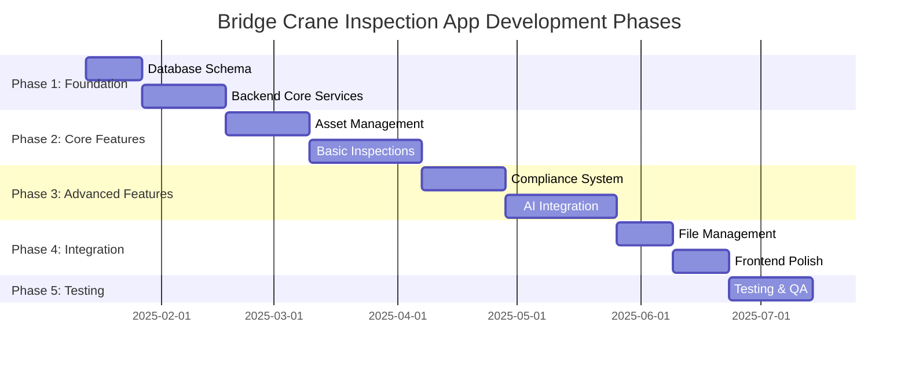

## Key Architectural Decisions

1. **SQLite Choice**: Provides offline capability and eliminates server dependencies while supporting complex queries needed for compliance reporting.

2. **Modular Compliance System**: Designed to easily accommodate additional standards beyond OSHA 1910.179 and ASME B30.2.

3. **AI-First Database Design**: Schema includes native support for AI model results and predictions from the ground up.

4. **ONNX.js for Client-Side AI**: Enables real-time analysis without server dependencies while maintaining user privacy.

5. **Comprehensive File Management**: Built-in support for multiple media types with automated AI analysis and metadata extraction.

6. **Offline-First Architecture**: All core functionality works without internet connectivity, with sync capabilities for team collaboration.

This architecture provides a robust foundation for building the Bridge Crane Inspection App with comprehensive AI integration, detailed compliance management, and enterprise-grade file handling capabilities.
## 6. Frontend State Management & Data Flow Architecture

### State Management Strategy

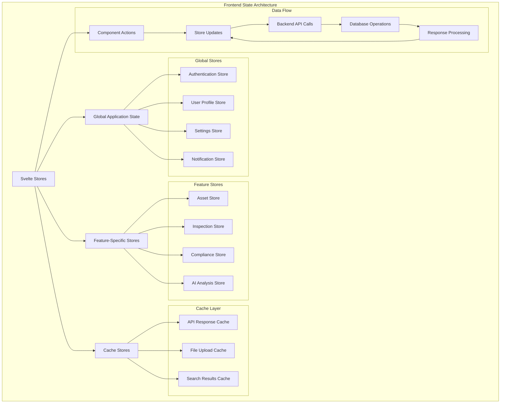

### Store Implementation Details

```javascript
// Global Authentication Store
import { writable, derived, get } from 'svelte/store';
import { invoke } from '@tauri-apps/api/core';

class AuthenticationStore {
    constructor() {
        this.user = writable(null);
        this.token = writable(null);
        this.permissions = writable([]);
        this.isAuthenticated = derived(
            [this.user, this.token],
            ([$user, $token]) => !!$user && !!$token
        );
        
        // Load stored auth data on startup
        this.loadStoredAuth();
    }
    
    async login(credentials) {
        try {
            const result = await invoke('authenticate_user', credentials);
            
            this.user.set(result.user);
            this.token.set(result.token);
            this.permissions.set(result.permissions);
            
            // Store securely via Tauri
            await invoke('store_auth_data', {
                user: result.user,
                token: result.token
            });
            
            return { success: true };
        } catch (error) {
            return { success: false, error: error.message };
        }
    }
    
    async logout() {
        this.user.set(null);
        this.token.set(null);
        this.permissions.set([]);
        
        await invoke('clear_auth_data');
    }
    
    hasPermission(permission) {
        const perms = get(this.permissions);
        return perms.includes(permission);
    }
}

// Asset Management Store
class AssetStore {
    constructor() {
        this.assets = writable([]);
        this.selectedAsset = writable(null);
        this.loading = writable(false);
        this.searchQuery = writable('');
        this.filters = writable({
            location: '',
            type: '',
            status: ''
        });
        
        // Derived stores for computed values
        this.filteredAssets = derived(
            [this.assets, this.searchQuery, this.filters],
            ([$assets, $query, $filters]) => {
                return $assets.filter(asset => 
                    this.matchesSearch(asset, $query) &&
                    this.matchesFilters(asset, $filters)
                );
            }
        );
    }
    
    async loadAssets() {
        this.loading.set(true);
        try {
            const assets = await invoke('get_assets');
            this.assets.set(assets);
        } catch (error) {
            console.error('Failed to load assets:', error);
        } finally {
            this.loading.set(false);
        }
    }
    
    async createAsset(assetData) {
        try {
            const newAsset = await invoke('create_asset', { asset: assetData });
            this.assets.update(assets => [...assets, newAsset]);
            return { success: true, asset: newAsset };
        } catch (error) {
            return { success: false, error: error.message };
        }
    }
    
    async updateAsset(assetId, updates) {
        try {
            const updatedAsset = await invoke('update_asset', { 
                assetId, 
                updates 
            });
            
            this.assets.update(assets => 
                assets.map(asset => 
                    asset.id === assetId ? updatedAsset : asset
                )
            );
            
            return { success: true, asset: updatedAsset };
        } catch (error) {
            return { success: false, error: error.message };
        }
    }
}

// Inspection Workflow Store
class InspectionStore {
    constructor() {
        this.currentInspection = writable(null);
        this.inspectionHistory = writable([]);
        this.checklist = writable([]);
        this.completedItems = writable(new Set());
        this.uploadedFiles = writable([]);
        this.aiAnalysisResults = writable({});
        
        // Derived computed values
        this.completionPercentage = derived(
            [this.checklist, this.completedItems],
            ([$checklist, $completed]) => {
                if ($checklist.length === 0) return 0;
                return ($completed.size / $checklist.length) * 100;
            }
        );
        
        this.pendingItems = derived(
            [this.checklist, this.completedItems],
            ([$checklist, $completed]) => {
                return $checklist.filter(item => !$completed.has(item.id));
            }
        );
    }
    
    async startInspection(assetId, inspectionType, complianceStandard) {
        try {
            const inspection = await invoke('create_inspection', {
                assetId,
                inspectionType,
                complianceStandard
            });
            
            const checklist = await invoke('get_compliance_checklist', {
                complianceStandard,
                inspectionType
            });
            
            this.currentInspection.set(inspection);
            this.checklist.set(checklist);
            this.completedItems.set(new Set());
            this.uploadedFiles.set([]);
            this.aiAnalysisResults.set({});
            
            return { success: true, inspection };
        } catch (error) {
            return { success: false, error: error.message };
        }
    }
    
    async completeInspectionItem(itemId, data) {
        try {
            await invoke('update_inspection_item', {
                itemId,
                data
            });
            
            this.completedItems.update(completed => {
                const newSet = new Set(completed);
                newSet.add(itemId);
                return newSet;
            });
            
            return { success: true };
        } catch (error) {
            return { success: false, error: error.message };
        }
    }
}
```

### Data Flow Patterns

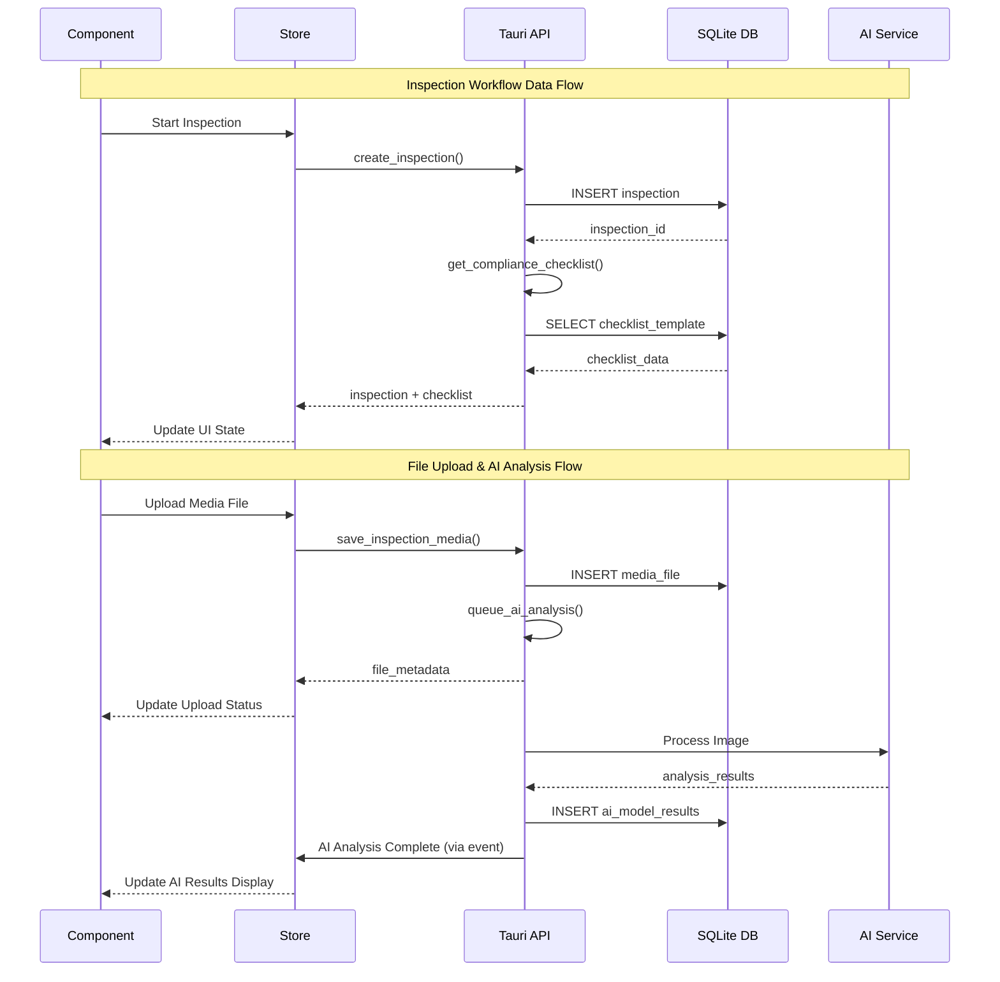

## 7. Security Architecture & Data Encryption

### Security Framework Overview

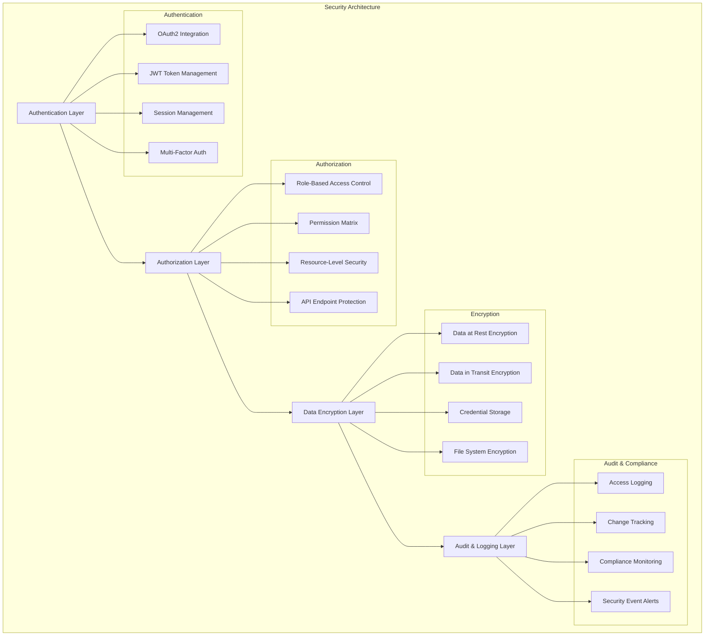

### Encryption Implementation

```rust
// Rust security service implementation
use ring::{aead, pbkdf2, rand};
use tauri_plugin_stronghold::StrongholdPlugin;
use serde::{Deserialize, Serialize};

pub struct SecurityService {
    stronghold: StrongholdPlugin,
    encryption_key: [u8; 32],
}

impl SecurityService {
    pub fn new() -> Result<Self, SecurityError> {
        let stronghold = StrongholdPlugin::new();
        let encryption_key = Self::derive_encryption_key()?;
        
        Ok(SecurityService {
            stronghold,
            encryption_key,
        })
    }
    
    // Database encryption for sensitive fields
    pub fn encrypt_sensitive_data(&self, data: &str) -> Result<String, SecurityError> {
        let aead = aead::CHACHA20_POLY1305;
        let unbound_key = aead::UnboundKey::new(&aead, &self.encryption_key)?;
        let key = aead::LessSafeKey::new(unbound_key);
        
        let mut nonce = [0u8; 12];
        rand::SystemRandom::new().fill(&mut nonce)?;
        
        let mut encrypted_data = data.as_bytes().to_vec();
        key.seal_in_place_append_tag(
            aead::Nonce::assume_unique_for_key(nonce),
            aead::Aad::empty(),
            &mut encrypted_data,
        )?;
        
        // Combine nonce + encrypted data
        let mut result = nonce.to_vec();
        result.extend_from_slice(&encrypted_data);
        
        Ok(base64::encode(result))
    }
    
    pub fn decrypt_sensitive_data(&self, encrypted_data: &str) -> Result<String, SecurityError> {
        let data = base64::decode(encrypted_data)?;
        
        if data.len() < 12 {
            return Err(SecurityError::InvalidEncryptedData);
        }
        
        let (nonce_bytes, encrypted_bytes) = data.split_at(12);
        let nonce = aead::Nonce::try_assume_unique_for_key(nonce_bytes)?;
        
        let aead = aead::CHACHA20_POLY1305;
        let unbound_key = aead::UnboundKey::new(&aead, &self.encryption_key)?;
        let key = aead::LessSafeKey::new(unbound_key);
        
        let mut decrypted_data = encrypted_bytes.to_vec();
        let decrypted_bytes = key.open_in_place(nonce, aead::Aad::empty(), &mut decrypted_data)?;
        
        Ok(String::from_utf8(decrypted_bytes.to_vec())?)
    }
    
    // File system encryption for uploaded media
    pub async fn encrypt_file(&self, file_path: &Path) -> Result<(), SecurityError> {
        let file_data = tokio::fs::read(file_path).await?;
        let encrypted_data = self.encrypt_file_data(&file_data)?;
        
        // Write encrypted data back to file
        tokio::fs::write(file_path, encrypted_data).await?;
        
        Ok(())
    }
    
    pub async fn decrypt_file(&self, file_path: &Path) -> Result<Vec<u8>, SecurityError> {
        let encrypted_data = tokio::fs::read(file_path).await?;
        self.decrypt_file_data(&encrypted_data)
    }
    
    // Secure credential storage using Stronghold
    pub async fn store_credentials(&self, key: &str, credentials: &Credentials) -> Result<(), SecurityError> {
        let serialized = serde_json::to_string(credentials)?;
        self.stronghold.set(key, serialized.into_bytes()).await?;
        Ok(())
    }
    
    pub async fn retrieve_credentials(&self, key: &str) -> Result<Credentials, SecurityError> {
        let data = self.stronghold.get(key).await?;
        let credentials: Credentials = serde_json::from_slice(&data)?;
        Ok(credentials)
    }
}

// Role-based access control
#[derive(Debug, Serialize, Deserialize)]
pub struct UserRole {
    pub name: String,
    pub permissions: Vec<Permission>,
    pub level: AccessLevel,
}

#[derive(Debug, Serialize, Deserialize)]
pub enum Permission {
    ReadAssets,
    WriteAssets,
    DeleteAssets,
    CreateInspections,
    SubmitInspections,
    ViewCompliance,
    ManageUsers,
    AccessAIInsights,
    ExportReports,
    SystemAdmin,
}

#[derive(Debug, Serialize, Deserialize)]
pub enum AccessLevel {
    Inspector,      // Basic inspection capabilities
    Supervisor,     // Team management + approval
    Administrator,  // Full system access
    SuperAdmin,     // System configuration
}

pub struct AuthorizationService {
    user_roles: HashMap<i64, Vec<UserRole>>,
}

impl AuthorizationService {
    pub fn check_permission(&self, user_id: i64, permission: Permission) -> bool {
        if let Some(roles) = self.user_roles.get(&user_id) {
            roles.iter().any(|role| role.permissions.contains(&permission))
        } else {
            false
        }
    }
    
    pub fn check_resource_access(&self, user_id: i64, resource_type: ResourceType, resource_id: i64) -> bool {
        // Implement resource-level access control
        match resource_type {
            ResourceType::Asset => self.check_asset_access(user_id, resource_id),
            ResourceType::Inspection => self.check_inspection_access(user_id, resource_id),
            ResourceType::Report => self.check_report_access(user_id, resource_id),
        }
    }
}
```

### Audit & Compliance Logging

```rust
// Comprehensive audit logging system
#[derive(Debug, Serialize, Deserialize)]
pub struct AuditLogEntry {
    pub timestamp: chrono::DateTime<chrono::Utc>,
    pub user_id: i64,
    pub action: AuditAction,
    pub resource_type: ResourceType,
    pub resource_id: Option<i64>,
    pub details: serde_json::Value,
    pub ip_address: Option<String>,
    pub user_agent: Option<String>,
    pub session_id: String,
}

#[derive(Debug, Serialize, Deserialize)]
pub enum AuditAction {
    Login,
    Logout,
    Create,
    Read,
    Update,
    Delete,
    Submit,
    Approve,
    Export,
    AIAnalysis,
    FileUpload,
    FileDownload,
    SystemConfig,
}

pub struct AuditService {
    db: Arc<Mutex<rusqlite::Connection>>,
}

impl AuditService {
    pub async fn log_action(
        &self,
        user_id: i64,
        action: AuditAction,
        resource_type: ResourceType,
        resource_id: Option<i64>,
        details: serde_json::Value,
        session_context: &SessionContext,
    ) -> Result<(), AuditError> {
        let entry = AuditLogEntry {
            timestamp: chrono::Utc::now(),
            user_id,
            action,
            resource_type,
            resource_id,
            details,
            ip_address: session_context.ip_address.clone(),
            user_agent: session_context.user_agent.clone(),
            session_id: session_context.session_id.clone(),
        };
        
        // Log to database
        self.write_audit_log(&entry).await?;
        
        // Check for security alerts
        self.check_security_alerts(&entry).await?;
        
        Ok(())
    }
    
    pub async fn generate_compliance_report(
        &self,
        start_date: chrono::DateTime<chrono::Utc>,
        end_date: chrono::DateTime<chrono::Utc>,
    ) -> Result<ComplianceReport, AuditError> {
        let logs = self.get_audit_logs(start_date, end_date).await?;
        
        ComplianceReport::generate(logs)
    }
}
```

## 8. Deployment & Build Configuration

### Build Pipeline Architecture

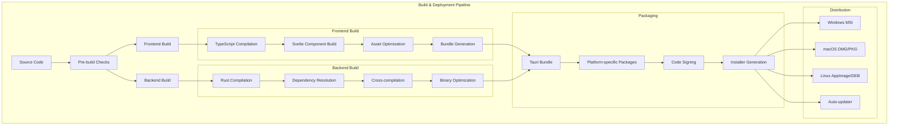

### Build Configuration Files

```toml
# Cargo.toml - Enhanced production configuration
[package]
name = "crane-pro-app"
version = "1.0.0"
description = "AI-Enhanced Bridge Crane Inspection Platform"
authors = ["CranePro Team"]
edition = "2021"
build = "build.rs"

[dependencies]
# Core Tauri dependencies
tauri = { version = "2", features = [
    "protocol-asset",
    "icon-ico",
    "icon-png",
    "system-tray",
    "api-all"
] }
tauri-plugin-fs = "2"
tauri-plugin-dialog = "2"
tauri-plugin-shell = "2"
tauri-plugin-stronghold = "2"
tauri-plugin-updater = "2"

# Database and serialization
rusqlite = { version = "0.29", features = ["bundled", "chrono", "serde_json"] }
serde = { version = "1.0", features = ["derive"] }
serde_json = "1.0"
chrono = { version = "0.4", features = ["serde"] }

# Security and encryption
ring = "0.17"
uuid = { version = "1.0", features = ["v4", "serde"] }
bcrypt = "0.15"
jsonwebtoken = "9.0"

# Async runtime and HTTP
tokio = { version = "1.0", features = ["full"] }
reqwest = { version = "0.11", features = ["json", "multipart"] }

# Image processing
image = { version = "0.24", features = ["jpeg", "png", "tiff"] }
exif = "0.6"

# Logging and error handling
log = "0.4"
env_logger = "0.10"
thiserror = "1.0"
anyhow = "1.0"

[build-dependencies]
tauri-build = { version = "2", features = ["isolation"] }

[profile.release]
opt-level = 3
lto = true
codegen-units = 1
panic = "abort"
strip = true

[profile.dev]
opt-level = 1
debug = true
```

```json
// package.json - Production frontend dependencies
{
  "name": "crane-pro-app-frontend",
  "version": "1.0.0",
  "type": "module",
  "scripts": {
    "dev": "vite dev --host",
    "build": "vite build",
    "build:prod": "NODE_ENV=production vite build --mode production",
    "preview": "vite preview",
    "check": "svelte-kit sync && svelte-check --tsconfig ./tsconfig.json",
    "check:watch": "svelte-kit sync && svelte-check --tsconfig ./tsconfig.json --watch",
    "tauri": "tauri",
    "tauri:dev": "tauri dev",
    "tauri:build": "tauri build",
    "tauri:build:debug": "tauri build --debug",
    "test": "vitest run",
    "test:watch": "vitest",
    "lint": "eslint src/",
    "lint:fix": "eslint src/ --fix"
  },
  "dependencies": {
    "@tauri-apps/api": "^2",
    "@tauri-apps/plugin-fs": "^2",
    "@tauri-apps/plugin-dialog": "^2",
    "@tauri-apps/plugin-shell": "^2",
    "@tauri-apps/plugin-updater": "^2",
    
    "svelte": "^5.0.0",
    "@sveltejs/kit": "^2.9.0",
    
    "cytoscape": "^3.26.0",
    "leaflet": "^1.9.4",
    "ag-grid-svelte": "^31.0.0",
    "chart.js": "^4.4.0",
    "chartjs-adapter-date-fns": "^3.0.0",
    
    "onnxjs": "^0.1.8",
    "@tensorflow/tfjs": "^4.15.0",
    
    "date-fns": "^2.30.0",
    "uuid": "^9.0.1",
    "fuse.js": "^7.0.0"
  },
  "devDependencies": {
    "@sveltejs/adapter-static": "^3.0.6",
    "@sveltejs/vite-plugin-svelte": "^5.0.0",
    "svelte-check": "^4.0.0",
    "typescript": "~5.6.2",
    "vite": "^6.0.3",
    "@tauri-apps/cli": "^2",
    
    "vitest": "^1.0.0",
    "@testing-library/svelte": "^4.1.0",
    "jsdom": "^23.0.0",
    
    "eslint": "^8.55.0",
    "@typescript-eslint/eslint-plugin": "^6.15.0",
    "@typescript-eslint/parser": "^6.15.0",
    "eslint-plugin-svelte": "^2.35.0",
    
    "prettier": "^3.1.0",
    "prettier-plugin-svelte": "^3.1.0"
  }
}
```

This comprehensive architecture now includes detailed frontend state management patterns, robust security and encryption implementations, and complete deployment configurations. The system is designed for enterprise-grade security, scalability, and maintainability while supporting the complex requirements of AI-enhanced crane inspection workflows.