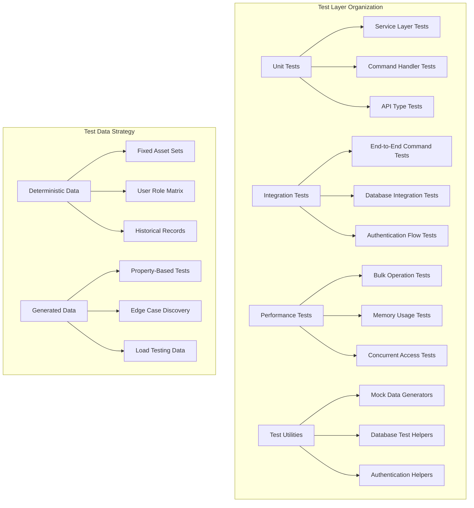

# Enhanced Asset Commands Test Architecture

## Executive Summary

This document provides a comprehensive test architecture for the CranePro Enhanced Asset Commands implementation. The architecture covers testing for 16 service methods and 18 command handlers with complete coverage of authentication, validation, bulk operations, and complex aggregations.

**Key Requirements Met:**
- **Database Strategy**: In-memory SQLite with automatic cleanup
- **Performance Targets**: 1000 assets import <10s, <100MB memory usage
- **Mock Strategy**: Real core logic, mocked external dependencies
- **Coverage Goal**: 80% code coverage focusing on critical paths

---

## 1. Test Infrastructure Architecture



## 2. Test Module Structure

### **Recommended File Organization**
```
src/
├── services/
│   ├── tests/
│   │   ├── mod.rs                      # Test module exports and common setup
│   │   ├── asset_service_tests.rs      # Core service method tests
│   │   ├── test_data_generator.rs      # Deterministic and generated test data
│   │   ├── test_database_helper.rs     # Database setup and cleanup utilities
│   │   └── performance_tests.rs        # Bulk operations and performance tests
│   └── asset_service.rs
├── commands/
│   ├── tests/
│   │   ├── mod.rs                      # Command test setup
│   │   ├── asset_commands_tests.rs     # Individual command handler tests
│   │   ├── integration_tests.rs        # End-to-end command flow tests
│   │   └── auth_flow_tests.rs          # Authentication and authorization tests
│   └── asset_commands.rs
├── api/
│   ├── tests/
│   │   ├── mod.rs                      # API test utilities
│   │   ├── request_validation_tests.rs # Request DTO validation and conversion
│   │   └── response_format_tests.rs    # Response DTO serialization tests
│   └── mod.rs
└── test_fixtures/
    ├── mod.rs                          # Global test fixtures and constants
    ├── asset_fixtures.rs               # Predefined asset test data
    ├── user_fixtures.rs                # User and authentication test data
    └── scenario_fixtures.rs            # Complex test scenarios
```

## 3. Test Priority Matrix

### **High Priority Tests (80% of effort)**

#### **Critical Service Methods**
1. **[`get_asset_summary()`](crane-pro-app/src-tauri/src/services.rs:568)**
   - Multi-table JOIN aggregation
   - Compliance score calculations
   - Historical data synthesis
   - Performance with large datasets

2. **[`bulk_import_assets()`](crane-pro-app/src-tauri/src/services.rs:701)**
   - Transaction integrity
   - Validation error handling
   - Memory usage monitoring
   - Rollback scenarios

3. **[`transfer_asset_location()`](crane-pro-app/src-tauri/src/services.rs:1039)**
   - Cross-entity validation
   - Audit logging verification
   - Location existence checks
   - User permission validation

#### **Authentication & Authorization**
- JWT token validation (valid, expired, malformed)
- Role-based access control for all commands
- Resource permission checking
- Session management

### **Medium Priority Tests (15% of effort)**
- CRUD operations with validation
- Pagination and filtering logic
- Component hierarchy management
- Error message formatting

### **Low Priority Tests (5% of effort)**
- Edge case input validation
- Performance optimization scenarios
- Complex query edge cases

## 4. Detailed Test Data Generation Strategy

### **Test Data Generator Architecture**
```rust
// Core test data generation structure
pub struct TestDataGenerator {
    seed: u64,
    database: Arc<TestDatabase>,
}

impl TestDataGenerator {
    pub fn new(seed: u64) -> Self {
        Self {
            seed,
            database: Arc::new(TestDatabase::new_in_memory()),
        }
    }
    
    pub fn deterministic() -> Self {
        Self::new(12345) // Fixed seed for consistent results
    }
    
    pub fn random() -> Self {
        Self::new(rand::random())
    }
}
```

### **Asset Test Data Sets**
```rust
pub struct AssetTestDataSets {
    // Basic asset types with realistic configurations
    pub bridge_cranes: Vec<Asset>,      // 10 bridge cranes with various capacities
    pub overhead_cranes: Vec<Asset>,    // 15 overhead cranes with different spans
    pub tower_cranes: Vec<Asset>,       // 5 tower cranes with height variations
    pub mobile_cranes: Vec<Asset>,      // 8 mobile cranes with capacity ranges
    
    // Assets with complex relationships
    pub assets_with_components: Vec<Asset>,     // 20 assets with 3-5 components each
    pub assets_with_history: Vec<Asset>,        // 15 assets with inspection history
    pub assets_with_maintenance: Vec<Asset>,    // 12 assets with maintenance records
    
    // Status and lifecycle test data
    pub active_assets: Vec<Asset>,              // Normal operational assets
    pub maintenance_assets: Vec<Asset>,         // Assets under maintenance
    pub decommissioned_assets: Vec<Asset>,      // End-of-life assets
    pub status_transition_assets: Vec<Asset>,   // Assets for testing status changes
    
    // Bulk operation test data
    pub bulk_import_valid: Vec<Asset>,          // 100 valid assets for import
    pub bulk_import_mixed: Vec<Asset>,          // 100 assets (70 valid, 30 invalid)
    pub bulk_import_large: Vec<Asset>,          // 1000+ assets for performance testing
    pub bulk_import_duplicate: Vec<Asset>,      // Assets with duplicate asset_numbers
    
    // Edge cases and validation test data
    pub invalid_assets: Vec<Asset>,             // Assets that should fail validation
    pub boundary_value_assets: Vec<Asset>,      // Min/max values for numeric fields
    pub special_character_assets: Vec<Asset>,   // Unicode, special chars in names
}

impl AssetTestDataSets {
    pub fn generate_deterministic() -> Self {
        let mut generator = TestDataGenerator::deterministic();
        
        Self {
            bridge_cranes: generator.create_bridge_cranes(10),
            overhead_cranes: generator.create_overhead_cranes(15),
            // ... other asset types
            bulk_import_large: generator.create_bulk_assets(1000),
            // ... rest of the sets
        }
    }
    
    pub fn minimal_set() -> Self {
        // Reduced dataset for faster unit tests
        Self {
            bridge_cranes: TestDataGenerator::deterministic().create_bridge_cranes(2),
            // ... minimal versions of each set
        }
    }
}
```

### **User and Authentication Test Data**
```rust
pub struct UserTestDataSets {
    // Core user roles with realistic configurations
    pub admin_user: User,
    pub supervisor_user: User,
    pub inspector_user: User,
    pub inactive_user: User,
    
    // Token scenarios for authentication testing
    pub valid_tokens: HashMap<UserRole, String>,
    pub expired_tokens: Vec<String>,
    pub malformed_tokens: Vec<String>,
    pub invalid_signature_tokens: Vec<String>,
    
    // Permission test scenarios
    pub users_by_role: HashMap<UserRole, Vec<User>>,
    pub permission_matrix: HashMap<(UserRole, String, String), bool>, // (role, resource, action) -> allowed
}

impl UserTestDataSets {
    pub fn generate_with_auth_helper(auth_helper: &AuthTestHelper) -> Self {
        let admin = User::new_test_user(UserRole::Administrator);
        let supervisor = User::new_test_user(UserRole::Supervisor);
        let inspector = User::new_test_user(UserRole::Inspector);
        
        let valid_tokens = hashmap! {
            UserRole::Administrator => auth_helper.generate_valid_token(&admin),
            UserRole::Supervisor => auth_helper.generate_valid_token(&supervisor),
            UserRole::Inspector => auth_helper.generate_valid_token(&inspector),
        };
        
        Self {
            admin_user: admin,
            supervisor_user: supervisor,
            inspector_user: inspector,
            inactive_user: User::new_inactive_user(),
            valid_tokens,
            expired_tokens: vec![
                auth_helper.generate_expired_token(&admin),
                auth_helper.generate_expired_token(&supervisor),
            ],
            // ... other token scenarios
        }
    }
}
```

### **Historical Data Generation**
```rust
pub struct HistoricalDataGenerator {
    start_date: DateTime<Utc>,
    end_date: DateTime<Utc>,
}

impl HistoricalDataGenerator {
    pub fn new(months_back: i64) -> Self {
        let end_date = Utc::now();
        let start_date = end_date - chrono::Duration::days(months_back * 30);
        
        Self { start_date, end_date }
    }
    
    pub fn generate_inspection_history(&self, asset: &Asset, frequency_days: i64) -> Vec<Inspection> {
        let mut inspections = Vec::new();
        let mut current_date = self.start_date;
        let mut inspection_id = 1;
        
        while current_date <= self.end_date {
            let inspection = Inspection {
                id: inspection_id,
                asset_id: asset.id,
                scheduled_date: Some(current_date),
                actual_date: Some(current_date + chrono::Duration::hours(2)),
                status: InspectionStatus::Completed,
                overall_condition: self.generate_realistic_condition(),
                // ... other realistic fields
            };
            
            inspections.push(inspection);
            current_date += chrono::Duration::days(frequency_days);
            inspection_id += 1;
        }
        
        inspections
    }
    
    pub fn generate_maintenance_history(&self, asset: &Asset) -> Vec<MaintenanceHistoryEntry> {
        // Generate realistic maintenance records with varying types and frequencies
        let maintenance_types = vec!["Preventive", "Corrective", "Emergency"];
        let mut records = Vec::new();
        
        // Generate 1-3 maintenance records per year
        for year_offset in 0..2 {
            let maintenance_count = 1 + (asset.id % 3); // 1-3 records per year
            for i in 0..maintenance_count {
                let record = MaintenanceHistoryEntry {
                    id: (year_offset * 10) + i,
                    maintenance_type: maintenance_types[(i as usize) % maintenance_types.len()].to_string(),
                    scheduled_date: Some(self.start_date + chrono::Duration::days(year_offset * 365 + i * 120)),
                    completed_date: Some(self.start_date + chrono::Duration::days(year_offset * 365 + i * 120 + 1)),
                    performed_by: format!("Technician-{}", (asset.id % 5) + 1),
                    description: format!("Routine {} maintenance for {}", maintenance_types[i as usize % maintenance_types.len()], asset.asset_name),
                    cost: Some(500.0 + (asset.id as f64 * 10.0)),
                    status: "Completed".to_string(),
                };
                records.push(record);
            }
        }
        
        records
    }
    
    fn generate_realistic_condition(&self) -> Option<Condition> {
        // Weight conditions toward Good/Fair for realistic distribution
        let conditions = vec![
            (Condition::Excellent, 10),  // 10% chance
            (Condition::Good, 40),       // 40% chance
            (Condition::Fair, 35),       // 35% chance
            (Condition::Poor, 12),       // 12% chance
            (Condition::Critical, 3),    // 3% chance
        ];
        
        // Use weighted random selection
        let total_weight: u32 = conditions.iter().map(|(_, weight)| weight).sum();
        let random_value = rand::random::<u32>() % total_weight;
        
        let mut cumulative_weight = 0;
        for (condition, weight) in conditions {
            cumulative_weight += weight;
            if random_value < cumulative_weight {
                return Some(condition);
            }
        }
        
        Some(Condition::Good) // Fallback
    }
}
```

## 5. Database Test Helper Implementation

### **TestDatabase Structure**
```rust
pub struct TestDatabase {
    database: Arc<Database>,
    cleanup_handles: Vec<tokio::task::JoinHandle<()>>,
}

impl TestDatabase {
    pub async fn new_in_memory() -> Self {
        let database = Arc::new(Database::new_in_memory().await.expect("Failed to create test database"));
        
        // Run migrations
        database.run_migrations().await.expect("Failed to run migrations");
        
        Self {
            database,
            cleanup_handles: Vec::new(),
        }
    }
    
    pub async fn seed_minimal_data(&self) -> TestDataFixtures {
        let fixtures = TestDataFixtures::minimal();
        self.seed_with_fixtures(&fixtures).await;
        fixtures
    }
    
    pub async fn seed_comprehensive_data(&self) -> TestDataFixtures {
        let fixtures = TestDataFixtures::comprehensive();
        self.seed_with_fixtures(&fixtures).await;
        fixtures
    }
    
    pub async fn seed_performance_data(&self) -> TestDataFixtures {
        let fixtures = TestDataFixtures::performance();
        self.seed_with_fixtures(&fixtures).await;
        fixtures
    }
    
    async fn seed_with_fixtures(&self, fixtures: &TestDataFixtures) {
        // Seed in dependency order: Users -> Locations -> Assets -> Components -> History
        
        // 1. Seed users first (required for asset creation)
        for user in &fixtures.users {
            self.database.with_transaction(|conn| {
                conn.execute(
                    "INSERT INTO users (id, username, email, password_hash, role, first_name, last_name, is_active, created_at, updated_at)
                     VALUES (?1, ?2, ?3, ?4, ?5, ?6, ?7, ?8, ?9, ?10)",
                    params![
                        user.id, user.username, user.email, user.password_hash,
                        user.role.to_string(), user.first_name, user.last_name,
                        user.is_active, user.created_at, user.updated_at
                    ]
                )?;
                Ok(())
            }).await.expect("Failed to seed user");
        }
        
        // 2. Seed locations
        for location in &fixtures.locations {
            self.database.with_transaction(|conn| {
                conn.execute(
                    "INSERT INTO locations (id, name, address, latitude, longitude, description, parent_location_id, created_by, created_at, updated_at)
                     VALUES (?1, ?2, ?3, ?4, ?5, ?6, ?7, ?8, ?9, ?10)",
                    params![
                        location.id, location.name, location.address, location.latitude,
                        location.longitude, location.description, location.parent_location_id,
                        location.created_by, location.created_at, location.updated_at
                    ]
                )?;
                Ok(())
            }).await.expect("Failed to seed location");
        }
        
        // 3. Seed assets
        for asset in &fixtures.assets {
            self.database.with_transaction(|conn| {
                conn.execute(
                    "INSERT INTO assets (id, asset_number, asset_name, asset_type, manufacturer, model, serial_number,
                     manufacture_date, installation_date, capacity, capacity_unit, location_id, status, description,
                     specifications, created_by, created_at, updated_at)
                     VALUES (?1, ?2, ?3, ?4, ?5, ?6, ?7, ?8, ?9, ?10, ?11, ?12, ?13, ?14, ?15, ?16, ?17, ?18)",
                    params![
                        asset.id, asset.asset_number, asset.asset_name, asset.asset_type,
                        asset.manufacturer, asset.model, asset.serial_number,
                        asset.manufacture_date, asset.installation_date, asset.capacity,
                        asset.capacity_unit, asset.location_id, asset.status.to_string(),
                        asset.description, asset.specifications.as_ref().map(|s| s.to_string()),
                        asset.created_by, asset.created_at, asset.updated_at
                    ]
                )?;
                Ok(())
            }).await.expect("Failed to seed asset");
        }
        
        // 4. Seed components (if any)
        for component in &fixtures.components {
            // Similar seeding logic for components
        }
        
        // 5. Seed historical data (inspections, maintenance)
        for inspection in &fixtures.inspections {
            // Seed inspection records
        }
        
        for maintenance in &fixtures.maintenance_records {
            // Seed maintenance records
        }
    }
    
    pub async fn reset(&self) {
        // Clean up all data while preserving schema
        self.database.with_transaction(|conn| {
            // Delete in reverse dependency order
            conn.execute("DELETE FROM inspection_items", [])?;
            conn.execute("DELETE FROM inspections", [])?;
            conn.execute("DELETE FROM maintenance_records", [])?;
            conn.execute("DELETE FROM media_files", [])?;
            conn.execute("DELETE FROM components", [])?;
            conn.execute("DELETE FROM assets", [])?;
            conn.execute("DELETE FROM locations", [])?;
            conn.execute("DELETE FROM users", [])?;
            
            // Reset auto-increment sequences
            conn.execute("DELETE FROM sqlite_sequence", [])?;
            
            Ok(())
        }).await.expect("Failed to reset database");
    }
    
    pub fn get_database(&self) -> Arc<Database> {
        self.database.clone()
    }
}

impl Drop for TestDatabase {
    fn drop(&mut self) {
        // Ensure cleanup on drop
        for handle in self.cleanup_handles.drain(..) {
            handle.abort();
        }
    }
}
```

### **Test Data Fixtures Structure**
```rust
pub struct TestDataFixtures {
    pub users: Vec<User>,
    pub locations: Vec<Location>,
    pub assets: Vec<Asset>,
    pub components: Vec<Component>,
    pub inspections: Vec<Inspection>,
    pub maintenance_records: Vec<MaintenanceHistoryEntry>,
}

impl TestDataFixtures {
    pub fn minimal() -> Self {
        Self {
            users: vec![
                User::test_admin(),
                User::test_inspector(),
            ],
            locations: vec![
                Location::test_facility_a(),
                Location::test_facility_b(),
            ],
            assets: vec![
                Asset::test_bridge_crane(),
                Asset::test_overhead_crane(),
            ],
            components: vec![],
            inspections: vec![],
            maintenance_records: vec![],
        }
    }
    
    pub fn comprehensive() -> Self {
        let asset_generator = AssetTestDataSets::generate_deterministic();
        let user_data = UserTestDataSets::generate_with_auth_helper(&AuthTestHelper::new());
        let history_generator = HistoricalDataGenerator::new(24); // 24 months of history
        
        let mut all_assets = Vec::new();
        all_assets.extend(asset_generator.bridge_cranes);
        all_assets.extend(asset_generator.overhead_cranes);
        all_assets.extend(asset_generator.assets_with_components);
        
        let mut all_inspections = Vec::new();
        let mut all_maintenance = Vec::new();
        
        // Generate historical data for each asset
        for asset in &all_assets {
            all_inspections.extend(history_generator.generate_inspection_history(asset, 90)); // Every 90 days
            all_maintenance.extend(history_generator.generate_maintenance_history(asset));
        }
        
        Self {
            users: vec![user_data.admin_user, user_data.supervisor_user, user_data.inspector_user],
            locations: Location::test_facilities(),
            assets: all_assets,
            components: Component::test_components(),
            inspections: all_inspections,
            maintenance_records: all_maintenance,
        }
    }
    
    pub fn performance() -> Self {
        // Large dataset for performance testing
        let asset_generator = AssetTestDataSets::generate_deterministic();
        
        Self {
            users: vec![User::test_admin()],
            locations: Location::test_facilities(),
            assets: asset_generator.bulk_import_large, // 1000+ assets
            components: vec![],
            inspections: vec![],
            maintenance_records: vec![],
        }
    }
}
```

## 6. Cleanup Strategy Implementation

### **Automatic Cleanup Mechanism**
```rust
pub struct TestCleanupManager {
    database: Arc<TestDatabase>,
    temp_files: Vec<PathBuf>,
    cleanup_registered: bool,
}

impl TestCleanupManager {
    pub fn new(database: Arc<TestDatabase>) -> Self {
        Self {
            database,
            temp_files: Vec::new(),
            cleanup_registered: false,
        }
    }
    
    pub fn register_cleanup(&mut self) {
        if !self.cleanup_registered {
            let db_clone = self.database.clone();
            let temp_files_clone = self.temp_files.clone();
            
            // Register cleanup to run after each test
            std::panic::set_hook(Box::new(move |_| {
                // Cleanup database
                tokio::runtime::Runtime::new()
                    .unwrap()
                    .block_on(async {
                        db_clone.reset().await;
                    });
                
                // Cleanup temporary files
                for file_path in &temp_files_clone {
                    let _ = std::fs::remove_file(file_path);
                }
            }));
            
            self.cleanup_registered = true;
        }
    }
    
    pub fn add_temp_file(&mut self, path: PathBuf) {
        self.temp_files.push(path);
    }
    
    pub async fn force_cleanup(&self) {
        self.database.reset().await;
        for file_path in &self.temp_files {
            let _ = std::fs::remove_file(file_path);
        }
    }
}
```

### **Test Isolation Pattern**
```rust
// Standard pattern for test isolation
pub async fn with_test_database<F, Fut, R>(test_fn: F) -> R
where
    F: FnOnce(Arc<TestDatabase>, TestDataFixtures) -> Fut,
    Fut: Future<Output = R>,
{
    let test_db = Arc::new(TestDatabase::new_in_memory().await);
    let fixtures = test_db.seed_minimal_data().await;
    
    let result = test_fn(test_db.clone(), fixtures).await;
    
    // Cleanup after test
    test_db.reset().await;
    
    result
}

// Usage in tests:
#[tokio::test]
async fn test_asset_summary_with_history() {
    with_test_database(|db, fixtures| async move {
        let services = Services::init(db.get_database()).await.unwrap();
        
        // Test implementation
        let summary = services.assets.get_asset_summary(fixtures.assets[0].id).await.unwrap();
        
        assert_eq!(summary.asset_name, fixtures.assets[0].asset_name);
        // ... other assertions
    }).await;
}
```

## 7. Performance Test Implementation

### **Performance Test Structure**
```rust
#[cfg(test)]
mod performance_tests {
    use super::*;
    use std::time::Instant;
    use tokio::runtime::Runtime;
    
    #[tokio::test]
    async fn test_bulk_import_performance() {
        with_test_database(|db, _| async move {
            let services = Services::init(db.get_database()).await.unwrap();
            
            // Generate 1000 test assets
            let test_assets = AssetTestDataSets::generate_deterministic().bulk_import_large;
            assert_eq!(test_assets.len(), 1000);
            
            // Measure memory before
            let memory_before = get_memory_usage();
            
            // Measure time
            let start_time = Instant::now();
            
            let result = services.assets.bulk_import_assets(test_assets).await.unwrap();
            
            let duration = start_time.elapsed();
            let memory_after = get_memory_usage();
            let memory_used = memory_after - memory_before;
            
            // Performance assertions
            assert!(duration.as_secs() < 10, "Bulk import took {}s, expected <10s", duration.as_secs());
            assert!(memory_used < 100 * 1024 * 1024, "Memory usage {}MB, expected <100MB", memory_used / (1024 * 1024));
            
            // Functional assertions
            assert_eq!(result.total_processed, 1000);
            assert_eq!(result.successful_imports, 1000);
            assert_eq!(result.failed_imports, 0);
        }).await;
    }
    
    #[tokio::test]
    async fn test_asset_summary_performance_with_large_history() {
        with_test_database(|db, _| async move {
            let services = Services::init(db.get_database()).await.unwrap();
            
            // Create asset with extensive history (2 years of monthly inspections)
            let asset = Asset::test_bridge_crane();
            let created_asset = services.assets.create_asset(asset).await.unwrap();
            
            // Generate large historical dataset
            let history_generator = HistoricalDataGenerator::new(24);
            let inspections = history_generator.generate_inspection_history(&created_asset, 30); // Monthly
            let maintenance = history_generator.generate_maintenance_history(&created_asset);
            
            // Seed historical data
            // ... seeding logic
            
            // Measure performance
            let start_time = Instant::now();
            let summary = services.assets.get_asset_summary(created_asset.id).await.unwrap();
            let duration = start_time.elapsed();
            
            // Performance assertion
            assert!(duration.as_millis() < 500, "Asset summary took {}ms, expected <500ms", duration.as_millis());
            
            // Functional assertions
            assert_eq!(summary.asset_id, created_asset.id);
            assert!(summary.total_inspections > 20); // Should have ~24 monthly inspections
            assert!(summary.compliance_score >= 0.0 && summary.compliance_score <= 100.0);
        }).await;
    }
    
    fn get_memory_usage() -> usize {
        // Platform-specific memory usage measurement
        #[cfg(target_os = "linux")]
        {
            use std::fs;
            let status = fs::read_to_string("/proc/self/status").unwrap_or_default();
            for line in status.lines() {
                if line.starts_with("VmRSS:") {
                    if let Some(kb_str) = line.split_whitespace().nth(1) {
                        if let Ok(kb) = kb_str.parse::<usize>() {
                            return kb * 1024; // Convert KB to bytes
                        }
                    }
                }
            }
        }
        
        // Fallback for other platforms
        0
    }
}
```

## 8. Implementation Roadmap

### **Phase 1: Foundation (Week 1)**
1. Set up test infrastructure and dependencies in [`Cargo.toml`](crane-pro-app/src-tauri/Cargo.toml:1)
2. Implement [`TestDatabase`](Enhanced_Asset_Commands_Test_Architecture.md:282) and cleanup mechanisms
3. Create basic test data generators and fixtures
4. Implement authentication test helpers

### **Phase 2: Service Layer Tests (Week 2)**
1. Implement unit tests for core service methods:
   - [`get_asset_summary()`](crane-pro-app/src-tauri/src/services.rs:568)
   - [`bulk_import_assets()`](crane-pro-app/src-tauri/src/services.rs:701)
   - [`transfer_asset_location()`](crane-pro-app/src-tauri/src/services.rs:1039)
2. Add CRUD operation tests with validation
3. Implement error scenario coverage

### **Phase 3: Command Handler Tests (Week 3)**
1. Implement command handler tests with authentication
2. Add integration tests for end-to-end flows
3. Test API request/response serialization
4. Add authorization and permission tests

### **Phase 4: Performance & Polish (Week 4)**
1. Implement performance tests with memory monitoring
2. Add property-based tests for edge case discovery
3. Achieve 80% code coverage target
4. Documentation and test maintenance guides

### **Dependencies to Add to Cargo.toml**
```toml
[dev-dependencies]
tokio-test = "0.4"           # Async testing utilities
mockall = "0.11"             # Advanced mocking capabilities
tempfile = "3.0"             # Temporary file management
assert_matches = "1.5"       # Pattern matching assertions
proptest = "1.0"             # Property-based testing
criterion = "0.5"            # Benchmarking framework
```

This comprehensive test architecture provides implementation-ready guidance for achieving robust test coverage of all Enhanced Asset Commands with clear performance targets and maintainable structure.