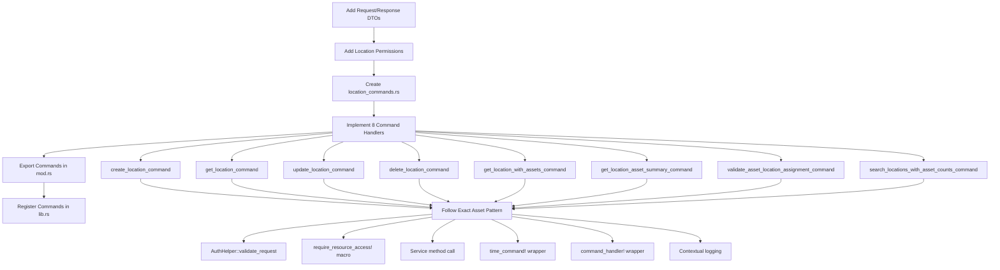

# Comprehensive Analysis of Existing Patterns for Location Commands Implementation

## Executive Summary

This document provides a complete analysis of existing code patterns in the CranePro Bridge Inspection Application that must be followed for implementing Location Commands. The analysis serves as the definitive blueprint for creating `location_commands.rs` with 8 command handlers that integrate with the existing LocationService.

## 1. Command Structure Pattern Analysis

### 1.1 Required Imports Pattern
Based on [`asset_commands.rs`](crane-pro-app/src-tauri/src/commands/asset_commands.rs):

```rust
use crate::api::{ApiResponse, QueryFilterRequest, CreateLocationRequest, LocationUpdateRequest, 
                PaginatedResponse};
use crate::commands::AppState;
use crate::middleware::auth::AuthHelper;
use crate::models::{Location, LocationUpdateData, LocationWithAssets, LocationAssetSummary, 
                   LocationWithAssetCount, LocationDeletionResult};
use crate::{require_resource_access, time_command, command_handler};
use tauri::State;
use log::{info, debug};
```

### 1.2 Authentication and Authorization Pattern
**Exact pattern from asset commands:**
```rust
// Step 1: Validate request and get context
let context = AuthHelper::validate_request(&state.auth_manager, token)
    .map_err(|e| format!("Authentication failed: {}", e))?;

// Step 2: Check resource access permissions
require_resource_access!(context, "location", "create"); // or read/update/delete
```

### 1.3 Command Handler Wrapper Pattern
**Exact structure:**
```rust
#[tauri::command]
pub async fn command_name(
    state: State<'_, AppState>,
    token: Option<String>,
    // parameters here
) -> Result<ApiResponse<ReturnType>, String> {
    let result = time_command!("command_name", {
        // Authentication and authorization
        let context = AuthHelper::validate_request(&state.auth_manager, token)
            .map_err(|e| format!("Authentication failed: {}", e))?;
        
        require_resource_access!(context, "resource", "action");

        // Business logic calling service
        let result = state.services.locations.service_method(params)
            .map_err(|e| format!("Failed to [action]: {}", e))?;

        // Logging with user context
        info!("Action completed: {} by user {}", 
              result_identifier, 
              context.current_user().map(|u| u.user_id).unwrap_or(0));

        Ok(result)
    });

    Ok(command_handler!("command_name", 
                       result.as_ref().ok().and_then(|_| None), 
                       { result }))
}
```

### 1.4 Error Handling Pattern
- Service errors wrapped with descriptive messages
- Authentication errors use standard format
- All errors return `String` for frontend consumption

### 1.5 Logging Pattern
- `info!` for successful operations with user context
- `debug!` for data retrieval operations
- Include relevant identifiers (location name, ID, user ID)

## 2. LocationService Integration Analysis

### 2.1 Available Service Methods
From [`services.rs`](crane-pro-app/src-tauri/src/services.rs) lines 2468-2758:

| Method | Signature | Return Type | Required Command |
|--------|-----------|-------------|------------------|
| `create_location` | `(location: Location)` | `AppResult<Location>` | `create_location_command` |
| `get_location_by_id` | `(id: i64)` | `AppResult<Location>` | `get_location_command` |
| `update_location` | `(id: i64, updates: LocationUpdateData)` | `AppResult<Location>` | `update_location_command` |
| `delete_location_safe` | `(id: i64)` | `AppResult<LocationDeletionResult>` | `delete_location_command` |
| `get_location_with_assets` | `(id: i64)` | `AppResult<LocationWithAssets>` | `get_location_with_assets_command` |
| `get_location_with_asset_summary` | `(id: i64)` | `AppResult<LocationAssetSummary>` | `get_location_asset_summary_command` |
| `validate_asset_location_assignment` | `(asset_id: i64, location_id: i64)` | `AppResult<()>` | `validate_asset_location_assignment_command` |
| `search_locations_with_asset_counts` | `(query: String, filter: QueryFilter)` | `AppResult<PaginatedResult<LocationWithAssetCount>>` | `search_locations_with_asset_counts_command` |

### 2.2 Service Integration Patterns
- Access via `state.services.locations.method_name()`
- Use existing service DTOs: `LocationUpdateData`
- Convert API requests to service parameters
- Return service results directly (no additional wrapping)

## 3. DTO Pattern Analysis

### 3.1 Request DTO Requirements
Based on [`requests.rs`](crane-pro-app/src-tauri/src/api/requests.rs) patterns:

```rust
#[derive(Debug, Serialize, Deserialize, Clone)]
pub struct CreateLocationRequest {
    pub name: String,
    pub address: Option<String>,
    pub latitude: Option<f64>,
    pub longitude: Option<f64>,
    pub description: Option<String>,
    pub parent_location_id: Option<i64>,
    pub created_by: i64,
}

impl CreateLocationRequest {
    pub fn to_location(self) -> Location {
        Location {
            id: 0, // Will be set by database
            name: self.name,
            address: self.address,
            latitude: self.latitude,
            longitude: self.longitude,
            description: self.description,
            parent_location_id: self.parent_location_id,
            created_by: self.created_by,
            created_at: Utc::now(),
            updated_at: Utc::now(),
        }
    }
}

#[derive(Debug, Serialize, Deserialize, Clone)]
pub struct LocationUpdateRequest {
    pub name: Option<String>,
    pub address: Option<String>,
    pub latitude: Option<f64>,
    pub longitude: Option<f64>,
    pub description: Option<String>,
    pub parent_location_id: Option<Option<i64>>, // Note: nested Option for nullability
}

impl From<LocationUpdateRequest> for LocationUpdateData {
    fn from(req: LocationUpdateRequest) -> Self {
        LocationUpdateData {
            name: req.name,
            address: req.address,
            latitude: req.latitude,
            longitude: req.longitude,
            description: req.description,
            parent_location_id: req.parent_location_id,
        }
    }
}
```

### 3.2 DTO Validation Requirements

#### 3.2.1 CreateLocationRequest Validation
**Pre-Service Validation** (in command handler):
```rust
// Validate required fields
if location_data.name.trim().is_empty() {
    return Err("Location name cannot be empty".to_string());
}

// Validate coordinates if provided
if let (Some(lat), Some(lng)) = (location_data.latitude, location_data.longitude) {
    if lat < -90.0 || lat > 90.0 {
        return Err("Latitude must be between -90 and 90 degrees".to_string());
    }
    if lng < -180.0 || lng > 180.0 {
        return Err("Longitude must be between -180 and 180 degrees".to_string());
    }
}

// Validate parent location if provided
if let Some(parent_id) = location_data.parent_location_id {
    if parent_id == 0 {
        return Err("Invalid parent location ID".to_string());
    }
}
```

#### 3.2.2 LocationUpdateRequest Validation
**Conditional Validation** (only validate provided fields):
```rust
// Validate name if provided
if let Some(ref name) = updates.name {
    if name.trim().is_empty() {
        return Err("Location name cannot be empty".to_string());
    }
}

// Validate coordinates if both provided
if let (Some(lat), Some(lng)) = (updates.latitude, updates.longitude) {
    if lat < -90.0 || lat > 90.0 || lng < -180.0 || lng > 180.0 {
        return Err("Invalid coordinates provided".to_string());
    }
}

// Validate parent location change
if let Some(Some(parent_id)) = updates.parent_location_id {
    if parent_id == id {
        return Err("Location cannot be its own parent".to_string());
    }
}
```

### 3.3 DTO Conversion Patterns

#### 3.3.1 Request to Model Conversion
```rust
// For CreateLocationRequest
let location = location_data.to_location();

// For LocationUpdateRequest
let update_data: LocationUpdateData = updates.into();
```

#### 3.3.2 QueryFilter Conversion
```rust
// Convert API request filter to service filter
let query_filter = filter.into();
```

#### 3.3.3 Paginated Response Conversion
```rust
// For search results
let response = PaginatedResponse::from(paginated_locations);
```

### 3.4 Response DTO Patterns
- Use existing model types directly: `Location`, `LocationWithAssets`, etc.
- Wrap paginated results in `PaginatedResponse<T>`
- Return complex types like `LocationDeletionResult` directly
- No additional response wrappers needed

### 3.5 Filter Integration
- Use existing `QueryFilterRequest` from API
- Convert to `QueryFilter` using `.into()` method
- Pass directly to service search methods

## 4. Permission System Analysis

### 4.1 Required Location Permissions
Add to [`middleware/mod.rs`](crane-pro-app/src-tauri/src/middleware/mod.rs) following asset pattern:

```rust
// Location permissions
pub const LOCATION_CREATE: &'static str = "location:create";
pub const LOCATION_READ: &'static str = "location:read";
pub const LOCATION_UPDATE: &'static str = "location:update";
pub const LOCATION_DELETE: &'static str = "location:delete";
pub const LOCATION_ALL: &'static str = "location:*";
```

### 4.2 Permission Assignment by Role
Update `Permissions::for_role()` method:

```rust
UserRole::Inspector => vec![
    // ... existing permissions
    Self::LOCATION_READ.to_string(),
],
UserRole::Supervisor => vec![
    // ... existing permissions
    Self::LOCATION_READ.to_string(),
    Self::LOCATION_UPDATE.to_string(),
],
UserRole::Administrator => vec![
    // ... existing permissions
    Self::LOCATION_ALL.to_string(),
],
```

### 4.3 Special Permission Handling
For `validate_asset_location_assignment_command`:
```rust
require_resource_access!(context, "location", "read");
require_resource_access!(context, "asset", "read");
```

### 4.4 Permission Validation Pattern
Use `require_resource_access!` macro consistently:
- Create: `require_resource_access!(context, "location", "create")`
- Read: `require_resource_access!(context, "location", "read")`
- Update: `require_resource_access!(context, "location", "update")`
- Delete: `require_resource_access!(context, "location", "delete")`

## 5. Integration Requirements

### 5.1 Commands Module Export
Add to [`commands/mod.rs`](crane-pro-app/src-tauri/src/commands/mod.rs):

```rust
pub mod location_commands;

// Re-export location command handlers
pub use location_commands::*;
```

### 5.2 Library Registration
Add to [`lib.rs`](crane-pro-app/src-tauri/src/lib.rs) imports:
```rust
use crate::commands::{
    // ... existing imports
    
    // Location commands
    create_location_command, get_location_command, update_location_command,
    delete_location_command, get_location_with_assets_command, 
    get_location_asset_summary_command, validate_asset_location_assignment_command,
    search_locations_with_asset_counts_command,
};
```

Add to `invoke_handler!`:
```rust
.invoke_handler(tauri::generate_handler![
    // ... existing commands
    
    // Location management commands (8 commands)
    create_location_command,
    get_location_command,
    update_location_command,
    delete_location_command,
    get_location_with_assets_command,
    get_location_asset_summary_command,
    validate_asset_location_assignment_command,
    search_locations_with_asset_counts_command,
])
```

## 6. Implementation Blueprint

### 6.1 Implementation Flow Diagram



### 6.2 File Structure
```
src/
├── api/
│   ├── requests.rs          # Add CreateLocationRequest, LocationUpdateRequest
│   └── responses.rs         # Use existing models, add any needed response types
├── commands/
│   ├── location_commands.rs # NEW FILE - 8 command handlers
│   └── mod.rs              # Add location_commands export
├── middleware/
│   └── mod.rs              # Add LOCATION_* permissions
└── lib.rs                  # Register location commands
```

### 6.3 Command Implementation Template

Each command follows this exact pattern:

```rust
/// [Command description]
#[tauri::command]
pub async fn [command_name](
    state: State<'_, AppState>,
    token: Option<String>,
    [parameters]
) -> Result<ApiResponse<[ReturnType]>, String> {
    let result = time_command!("[command_name_for_timing]", {
        // Authenticate and authorize
        let context = AuthHelper::validate_request(&state.auth_manager, token)
            .map_err(|e| format!("Authentication failed: {}", e))?;
        
        require_resource_access!(context, "location", "[action]");

        // [Additional authorization if needed]

        // Call service method
        let [result_var] = state.services.locations.[service_method]([params])
            .map_err(|e| format!("Failed to [action]: {}", e))?;

        [logging_statement];

        Ok([result_var])
    });

    Ok(command_handler!("[command_name_for_timing]", 
                       result.as_ref().ok().and_then(|_| None), 
                       { result }))
}
```

## 7. Specific Command Requirements

### 7.1 create_location_command
- **Input**: `CreateLocationRequest`
- **Permission**: `"location", "create"`
- **Service**: `create_location(location_data.to_location())`
- **Logging**: Include location name and user ID

### 7.2 get_location_command
- **Input**: `id: i64`
- **Permission**: `"location", "read"`
- **Service**: `get_location_by_id(id)`
- **Logging**: Include location name and ID

### 7.3 update_location_command
- **Input**: `id: i64, updates: LocationUpdateRequest`
- **Permission**: `"location", "update"`
- **Service**: `update_location(id, updates.into())`
- **Logging**: Include location name, ID, and user ID

### 7.4 delete_location_command
- **Input**: `id: i64`
- **Permission**: `"location", "delete"`
- **Service**: `delete_location_safe(id)`
- **Logging**: Include ID and user ID
- **Returns**: `LocationDeletionResult`

### 7.5 get_location_with_assets_command
- **Input**: `id: i64`
- **Permission**: `"location", "read"`
- **Service**: `get_location_with_assets(id)`
- **Logging**: Include location name and asset count

### 7.6 get_location_asset_summary_command
- **Input**: `id: i64`
- **Permission**: `"location", "read"`
- **Service**: `get_location_with_asset_summary(id)`
- **Logging**: Include location name and summary data

### 7.7 validate_asset_location_assignment_command
- **Input**: `asset_id: i64, location_id: i64`
- **Permissions**: `"location", "read"` AND `"asset", "read"`
- **Service**: `validate_asset_location_assignment(asset_id, location_id)`
- **Logging**: Include both asset and location IDs

### 7.8 search_locations_with_asset_counts_command
- **Input**: `query: String, filter: QueryFilterRequest`
- **Permission**: `"location", "read"`
- **Service**: `search_locations_with_asset_counts(query, filter.into())`
- **Returns**: `PaginatedResponse<LocationWithAssetCount>`
- **Logging**: Include query and result count

## 8. Error Handling Specifications

### 8.1 Standard Error Formats
- Authentication: `"Authentication failed: {}"`
- Service errors: `"Failed to [action] location: {}"`
- Validation errors: Use service validation messages

### 8.2 Logging Levels
- **info!**: Successful state changes (create, update, delete)
- **debug!**: Read operations and search queries
- Include user context in all logs where authentication is required

## 9. Testing Considerations

### 9.1 Command Testing Pattern
Each command should be tested for:
- Valid authentication and authorization
- Invalid token handling
- Permission denial scenarios
- Service error propagation
- Successful operation logging

### 9.2 Integration Testing
- Verify all commands are properly registered
- Test permission inheritance by role
- Validate DTO conversion methods
- Ensure proper error message formatting

## 10. Implementation Checklist

- [ ] Add `CreateLocationRequest` and `LocationUpdateRequest` to `api/requests.rs`
- [ ] Add location permissions to `middleware/mod.rs`
- [ ] Update role permissions in `Permissions::for_role()`
- [ ] Create `commands/location_commands.rs` with 8 handlers
- [ ] Add `location_commands` export to `commands/mod.rs`
- [ ] Add location command imports to `lib.rs`
- [ ] Register all 8 commands in `invoke_handler!`
- [ ] Test authentication and authorization flows
- [ ] Verify logging output format
- [ ] Validate error message consistency

## Conclusion

This analysis provides the complete blueprint for implementing Location Commands with exact pattern consistency. All patterns have been derived from the existing asset command implementation and adapted for location-specific requirements. The implementation must follow these patterns precisely to maintain code consistency and functionality across the CranePro application.