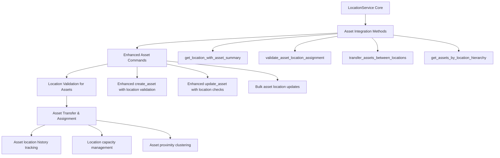
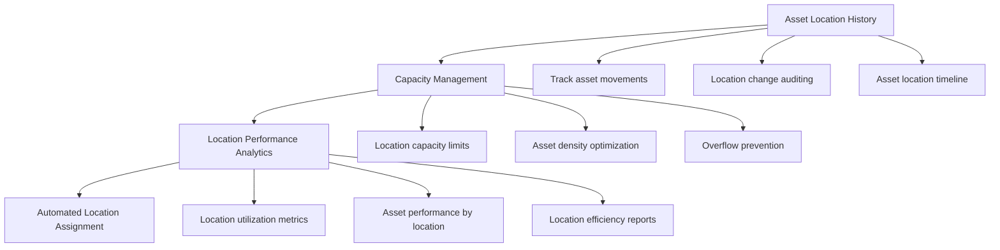

# CranePro Location Management Implementation Plan
## Asset Management Integration Focus

### Executive Summary

This plan implements comprehensive Location Management functionality for the CranePro Bridge Inspection Application with **primary focus on seamless Asset Management integration**. The implementation follows existing architectural patterns while ensuring zero disruption to current asset workflows and providing enhanced location-based asset management capabilities.

---

## Architecture Analysis Summary

### Existing Asset Management Integration Points

Based on analysis of the current codebase:

1. **Current Asset-Location Relationship**: [`Asset.location_id`](crane-pro-app/src-tauri/src/models.rs:182) field already exists
2. **Existing Integration**: [`get_assets_by_location`](crane-pro-app/src-tauri/src/services.rs:251) service method implemented
3. **Database Schema**: [`locations` table](crane-pro-app/src-tauri/src/database/core.rs:323) with foreign key relationship to assets
4. **Command Integration**: [`get_assets_by_location_command`](crane-pro-app/src-tauri/src/commands/asset_commands.rs:76) already in use

### Key Architectural Patterns Identified

- **Service Layer Pattern**: [`AssetService`](crane-pro-app/src-tauri/src/services.rs:193) with repository pattern
- **Command Handler Pattern**: [`asset_commands.rs`](crane-pro-app/src-tauri/src/commands/asset_commands.rs:1) with authentication
- **Error Handling**: [`AppError`](crane-pro-app/src-tauri/src/errors.rs:16)/[`AppResult`](crane-pro-app/src-tauri/src/errors.rs:11) system
- **Database Integration**: [`Database::with_transaction`](crane-pro-app/src-tauri/src/database/core.rs:165) with connection pooling
- **Authentication**: [`AuthHelper::validate_request`](crane-pro-app/src-tauri/src/middleware/auth.rs:251) with JWT tokens

---

## Implementation Plan: Asset Management Integration First

### Phase 1: Asset Management Integration Foundation (Priority 1)



#### 1.1 Core LocationService with Asset Integration Focus

```rust
pub struct LocationService {
    database: Arc<Database>,
    asset_service: Arc<AssetService>, // Direct integration
}

impl LocationService {
    // Asset-focused core operations
    pub fn create_location(&self, location: Location) -> AppResult<Location>
    pub fn get_location_with_assets(&self, id: i64) -> AppResult<LocationWithAssets>
    pub fn update_location(&self, id: i64, updates: LocationUpdateData) -> AppResult<Location>
    pub fn delete_location_safe(&self, id: i64) -> AppResult<LocationDeletionResult>
    
    // Asset Integration Methods (Priority)
    pub fn get_location_with_asset_summary(&self, id: i64) -> AppResult<LocationAssetSummary>
    pub fn validate_asset_location_assignment(&self, asset_id: i64, location_id: i64) -> AppResult<()>
    pub fn transfer_assets_between_locations(&self, from_id: i64, to_id: i64, asset_ids: Vec<i64>) -> AppResult<AssetTransferResult>
    pub fn get_assets_by_location_hierarchy(&self, location_id: i64, include_children: bool) -> AppResult<Vec<Asset>>
    
    // Asset-centric search and filtering
    pub fn search_locations_with_asset_counts(&self, query: String, filter: QueryFilter) -> AppResult<PaginatedResult<LocationWithAssetCount>>
    pub fn get_locations_by_asset_criteria(&self, criteria: AssetLocationCriteria) -> AppResult<Vec<Location>>
    
    // Asset workflow support
    pub fn get_available_locations_for_asset(&self, asset_type: String) -> AppResult<Vec<Location>>
    pub fn suggest_optimal_location_for_asset(&self, asset: &Asset) -> AppResult<Vec<LocationSuggestion>>
}
```

#### 1.2 Enhanced Asset Command Integration

**Extend existing asset commands with location intelligence:**

```rust
// Enhanced asset_commands.rs methods

/// Enhanced create asset with location validation and suggestions
#[tauri::command]
pub async fn create_asset_with_location_validation_command(
    state: State<'_, AppState>,
    token: Option<String>,
    asset_data: CreateAssetRequest,
) -> Result<ApiResponse<AssetCreationResult>, String>

/// Enhanced get assets by location with hierarchy support
#[tauri::command] 
pub async fn get_assets_by_location_enhanced_command(
    state: State<'_, AppState>,
    token: Option<String>,
    location_id: i64,
    include_child_locations: bool,
    filter: QueryFilterRequest,
) -> Result<ApiResponse<PaginatedResponse<AssetWithLocationInfo>>, String>

/// New: Transfer assets between locations
#[tauri::command]
pub async fn transfer_assets_command(
    state: State<'_, AppState>,
    token: Option<String>,
    transfer_request: AssetTransferRequest,
) -> Result<ApiResponse<AssetTransferResult>, String>

/// New: Get location suggestions for asset
#[tauri::command]
pub async fn get_location_suggestions_for_asset_command(
    state: State<'_, AppState>,
    token: Option<String>,
    asset_id: i64,
) -> Result<ApiResponse<Vec<LocationSuggestion>>, String>
```

#### 1.3 Asset-Location DTOs

```rust
// Asset Management Integration DTOs
#[derive(Debug, Serialize, Deserialize, Clone)]
pub struct LocationWithAssets {
    #[serde(flatten)]
    pub location: Location,
    pub assets: Vec<Asset>,
    pub asset_count: i64,
    pub asset_types: HashMap<String, i64>,
}

#[derive(Debug, Serialize, Deserialize, Clone)]
pub struct LocationAssetSummary {
    pub location_id: i64,
    pub location_name: String,
    pub total_assets: i64,
    pub active_assets: i64,
    pub maintenance_assets: i64,
    pub asset_value_total: Option<f64>,
    pub recent_inspections: i64,
    pub overdue_inspections: i64,
    pub asset_types_breakdown: HashMap<String, AssetTypeStats>,
}

#[derive(Debug, Serialize, Deserialize, Clone)]
pub struct AssetTransferRequest {
    pub asset_ids: Vec<i64>,
    pub from_location_id: i64,
    pub to_location_id: i64,
    pub transfer_reason: String,
    pub scheduled_date: Option<DateTime<Utc>>,
}

#[derive(Debug, Serialize, Deserialize, Clone)]
pub struct AssetTransferResult {
    pub transferred_count: i64,
    pub failed_transfers: Vec<AssetTransferFailure>,
    pub location_updates: Vec<LocationUpdateSummary>,
}

#[derive(Debug, Serialize, Deserialize, Clone)]
pub struct LocationSuggestion {
    pub location: Location,
    pub match_score: f64,
    pub reasons: Vec<String>,
    pub capacity_available: bool,
    pub proximity_to_related_assets: f64,
}
```

### Phase 2: Enhanced Asset Workflows (Priority 2)



#### 2.1 Asset Location History & Auditing

```rust
impl LocationService {
    pub fn track_asset_location_change(&self, asset_id: i64, from_location_id: Option<i64>, to_location_id: i64, reason: String) -> AppResult<()>
    pub fn get_asset_location_history(&self, asset_id: i64) -> AppResult<Vec<AssetLocationHistoryEntry>>
    pub fn get_location_change_audit_log(&self, location_id: i64, date_range: DateRange) -> AppResult<Vec<LocationAuditEntry>>
}

#[derive(Debug, Serialize, Deserialize, Clone)]
pub struct AssetLocationHistoryEntry {
    pub id: i64,
    pub asset_id: i64,
    pub from_location: Option<LocationSummary>,
    pub to_location: LocationSummary,
    pub changed_by: UserSummary,
    pub change_reason: String,
    pub change_date: DateTime<Utc>,
    pub inspection_triggered: bool,
}
```

#### 2.2 Location Capacity Management

```rust
impl LocationService {
    pub fn set_location_capacity_limits(&self, location_id: i64, limits: LocationCapacityLimits) -> AppResult<()>
    pub fn check_location_capacity(&self, location_id: i64, additional_assets: i64) -> AppResult<CapacityCheckResult>
    pub fn get_location_utilization(&self, location_id: i64) -> AppResult<LocationUtilization>
    pub fn suggest_capacity_optimization(&self, location_id: i64) -> AppResult<Vec<CapacityOptimizationSuggestion>>
}

#[derive(Debug, Serialize, Deserialize, Clone)]
pub struct LocationCapacityLimits {
    pub max_total_assets: Option<i64>,
    pub max_asset_value: Option<f64>,
    pub max_assets_per_type: HashMap<String, i64>,
    pub physical_space_limit: Option<f64>,
}

#[derive(Debug, Serialize, Deserialize, Clone)]
pub struct LocationUtilization {
    pub location_id: i64,
    pub current_asset_count: i64,
    pub capacity_percentage: f64,
    pub value_utilization: f64,
    pub space_utilization: Option<f64>,
    pub efficiency_score: f64,
}
```

### Phase 3: Advanced Asset-Location Features (Priority 3)

#### 3.1 Asset Proximity and Clustering

```rust
impl LocationService {
    pub fn find_related_assets_by_proximity(&self, asset_id: i64, radius_km: f64) -> AppResult<Vec<AssetWithDistance>>
    pub fn suggest_asset_clustering_optimizations(&self, location_ids: Vec<i64>) -> AppResult<Vec<ClusteringOptimization>>
    pub fn analyze_asset_distribution_efficiency(&self) -> AppResult<DistributionAnalysis>
}
```

#### 3.2 Location Hierarchy with Asset Inheritance

```rust
impl LocationService {
    // Hierarchy with asset perspective
    pub fn get_location_tree_with_asset_counts(&self, root_id: Option<i64>) -> AppResult<Vec<LocationTreeNodeWithAssets>>
    pub fn move_location_with_assets(&self, location_id: i64, new_parent_id: Option<i64>) -> AppResult<LocationMoveResult>
    pub fn get_inherited_asset_policies(&self, location_id: i64) -> AppResult<Vec<AssetPolicy>>
}

#[derive(Debug, Serialize, Deserialize, Clone)]
pub struct LocationTreeNodeWithAssets {
    pub location: Location,
    pub asset_count: i64,
    pub asset_value_total: f64,
    pub children: Vec<LocationTreeNodeWithAssets>,
    pub depth: i32,
}
```

### Phase 4: Asset Management Service Integration

#### 4.1 Enhanced AssetService Methods

**Extend existing AssetService with location intelligence:**

```rust
impl AssetService {
    // Enhanced existing methods
    pub fn create_asset_with_location_validation(&self, asset: Asset) -> AppResult<Asset>
    pub fn update_asset_with_location_checks(&self, id: i64, updates: AssetUpdateData) -> AppResult<Asset>
    
    // New location-aware methods
    pub fn get_assets_with_location_details(&self, filter: QueryFilter) -> AppResult<PaginatedResult<AssetWithLocationDetails>>
    pub fn search_assets_by_location_criteria(&self, criteria: AssetLocationSearchCriteria) -> AppResult<PaginatedResult<Asset>>
    pub fn validate_asset_location_compatibility(&self, asset: &Asset, location_id: i64) -> AppResult<CompatibilityResult>
    
    // Bulk operations with location awareness
    pub fn bulk_update_asset_locations(&self, updates: Vec<AssetLocationUpdate>) -> AppResult<BulkUpdateResult>
    pub fn migrate_assets_between_locations(&self, migration: LocationMigrationPlan) -> AppResult<MigrationResult>
}
```

#### 4.2 Integration with Existing Commands

**Enhance existing asset commands without breaking changes:**

```rust
// Backward compatible enhancements to existing commands
pub async fn get_asset_command() // Add location details to response
pub async fn update_asset_command() // Add location validation
pub async fn search_assets_command() // Add location-based filtering
pub async fn get_asset_components_command() // Include location context
```

---

## Database Schema Updates

### Asset-Location Integration Tables

```sql
-- Asset location history tracking
CREATE TABLE asset_location_history (
    id INTEGER PRIMARY KEY AUTOINCREMENT,
    asset_id INTEGER NOT NULL,
    from_location_id INTEGER,
    to_location_id INTEGER NOT NULL,
    changed_by INTEGER NOT NULL,
    change_reason TEXT,
    change_date DATETIME NOT NULL DEFAULT CURRENT_TIMESTAMP,
    FOREIGN KEY (asset_id) REFERENCES assets(id),
    FOREIGN KEY (from_location_id) REFERENCES locations(id),
    FOREIGN KEY (to_location_id) REFERENCES locations(id),
    FOREIGN KEY (changed_by) REFERENCES users(id)
);

-- Location capacity management
CREATE TABLE location_capacity_settings (
    id INTEGER PRIMARY KEY AUTOINCREMENT,
    location_id INTEGER NOT NULL UNIQUE,
    max_total_assets INTEGER,
    max_asset_value REAL,
    physical_space_limit REAL,
    capacity_rules JSON,
    created_at DATETIME NOT NULL DEFAULT CURRENT_TIMESTAMP,
    updated_at DATETIME NOT NULL DEFAULT CURRENT_TIMESTAMP,
    FOREIGN KEY (location_id) REFERENCES locations(id)
);

-- Add parent_location_id for hierarchy
ALTER TABLE locations ADD COLUMN parent_location_id INTEGER REFERENCES locations(id);

-- Performance indexes for asset-location queries
CREATE INDEX idx_asset_location_history_asset_id ON asset_location_history(asset_id);
CREATE INDEX idx_asset_location_history_location_ids ON asset_location_history(from_location_id, to_location_id);
CREATE INDEX idx_locations_parent_id ON locations(parent_location_id);
CREATE INDEX idx_locations_coordinates ON locations(latitude, longitude) WHERE latitude IS NOT NULL AND longitude IS NOT NULL;
```

---

## Integration Testing Strategy

### Critical Asset-Location Integration Tests

```rust
#[cfg(test)]
mod asset_location_integration_tests {
    // Test existing asset workflows are unaffected
    #[tokio::test]
    async fn test_existing_asset_creation_unchanged()
    
    #[tokio::test] 
    async fn test_get_assets_by_location_enhanced()
    
    #[tokio::test]
    async fn test_asset_location_validation()
    
    #[tokio::test]
    async fn test_asset_transfer_between_locations()
    
    #[tokio::test]
    async fn test_location_deletion_with_assets()
    
    #[tokio::test]
    async fn test_bulk_asset_location_updates()
    
    // Performance tests
    #[tokio::test]
    async fn test_location_hierarchy_asset_queries_performance()
}
```

---

## Backward Compatibility Guarantees

### Existing Asset API Compatibility

1. **Zero Breaking Changes**: All existing asset commands maintain exact same signatures
2. **Enhanced Responses**: Existing responses get additional location fields (optional/nullable)
3. **Database Compatibility**: All existing asset data remains valid
4. **Performance**: No degradation to existing asset operations

### Migration Strategy

1. **Gradual Enhancement**: New location features added alongside existing functionality
2. **Feature Flags**: Location enhancements can be enabled/disabled per feature
3. **Data Migration**: Automatic migration of existing asset-location relationships
4. **Rollback Support**: Full rollback capability if issues arise

---

## Success Criteria

### Asset Management Integration Metrics

1. ✅ **Zero Downtime**: Existing asset workflows continue uninterrupted
2. ✅ **Enhanced Asset Creation**: Location validation and suggestions integrated
3. ✅ **Improved Asset Search**: Location-based filtering and proximity search
4. ✅ **Asset Transfer Workflows**: Seamless asset movement between locations
5. ✅ **Location-Aware Reporting**: Enhanced asset reports with location context
6. ✅ **Capacity Management**: Prevent asset overflow and optimize distribution
7. ✅ **Audit Trail**: Complete tracking of asset location changes
8. ✅ **Performance**: Sub-100ms response times for asset-location queries
9. ✅ **Scalability**: Support for 10,000+ assets across 1,000+ locations
10. ✅ **Integration Tests**: 100% pass rate for asset-location integration scenarios

---

## File Structure

```
crane-pro-app/src-tauri/src/
├── services.rs (add LocationService, enhance AssetService)
├── commands/
│   ├── mod.rs (export location_commands)
│   ├── location_commands.rs (new)
│   └── asset_commands.rs (enhance existing commands)
├── api/
│   ├── requests.rs (add asset-location integration DTOs)
│   └── responses.rs (add enhanced asset responses)
├── models.rs (enhance Location model, add integration types)
├── database/
│   └── migrations.rs (add asset-location tables)
└── lib.rs (register new commands)
```

---

## Implementation Priority Order

1. **Week 1**: Core LocationService with asset integration methods
2. **Week 1**: Enhanced asset commands with location validation  
3. **Week 1**: Asset transfer and assignment workflows
4. **Week 2**: Location capacity management and optimization
5. **Week 2**: Asset location history and auditing
6. **Week 2**: Advanced features (proximity, hierarchy, bulk operations)

This plan ensures Location Management serves as a powerful foundation that enhances existing Asset Management workflows while providing advanced location-based capabilities for future system growth.