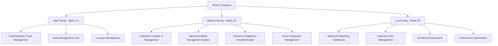
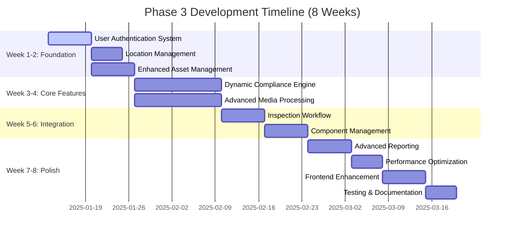

# Phase 3 Development Plan: Basic Features Implementation
## AI-Enhanced Bridge Crane Inspection App

### Executive Summary

Phase 3 focuses on implementing core functionality that enables basic crane inspection workflows, prioritizing robust backend APIs and business logic with enhanced frontend interfaces. This plan maintains the existing Tauri + Rust + Svelte + SQLite architecture while implementing advanced compliance checklist systems and comprehensive media management capabilities.

**Duration:** 8 weeks  
**Team Size:** 3-5 developers  
**Focus:** Inspector-centric workflows + Administrative capabilities  
**Architecture:** Backend-first with balanced full-stack implementation

---

## Priority Matrix & Feature Ranking



---

## Detailed Implementation Sequence

### Week 1-2: Foundation Features (High Priority)

#### 1. User Authentication & Management
**Backend Implementation:**

**New Tauri Commands to Implement:**
```rust
// src-tauri/src/commands/user_commands.rs

#[tauri::command]
pub async fn create_user_command(
    state: State<'_, AppState>,
    token: Option<String>,
    user_data: CreateUserRequest,
) -> Result<ApiResponse<User>, String>

#[tauri::command]
pub async fn get_users_command(
    state: State<'_, AppState>,
    token: Option<String>,
    filter: QueryFilterRequest,
) -> Result<ApiResponse<PaginatedResponse<User>>, String>

#[tauri::command]
pub async fn update_user_command(
    state: State<'_, AppState>,
    token: Option<String>,
    id: i64,
    updates: UserUpdateRequest,
) -> Result<ApiResponse<User>, String>

#[tauri::command]
pub async fn delete_user_command(
    state: State<'_, AppState>,
    token: Option<String>,
    id: i64,
) -> Result<ApiResponse<()>, String>

#[tauri::command]
pub async fn change_password_command(
    state: State<'_, AppState>,
    token: Option<String>,
    old_password: String,
    new_password: String,
) -> Result<ApiResponse<()>, String>

#[tauri::command]
pub async fn login_command(
    state: State<'_, AppState>,
    credentials: LoginRequest,
) -> Result<ApiResponse<LoginResponse>, String>

#[tauri::command]
pub async fn logout_command(
    state: State<'_, AppState>,
    token: String,
) -> Result<ApiResponse<()>, String>
```

**Enhanced Security Features:**
```rust
// src-tauri/src/security.rs - Enhanced authentication

pub struct AuthenticationService {
    jwt_secret: String,
    password_hasher: PasswordHasher,
    session_manager: SessionManager,
}

impl AuthenticationService {
    pub fn hash_password(&self, password: &str) -> AppResult<String> {
        bcrypt::hash(password, bcrypt::DEFAULT_COST)
            .map_err(|e| AppError::security("Password hashing failed", e.to_string()))
    }
    
    pub fn verify_password(&self, password: &str, hash: &str) -> AppResult<bool> {
        bcrypt::verify(password, hash)
            .map_err(|e| AppError::security("Password verification failed", e.to_string()))
    }
    
    pub fn generate_jwt_token(&self, user: &User) -> AppResult<String> {
        let claims = Claims {
            sub: user.id.to_string(),
            role: user.role.to_string(),
            exp: (chrono::Utc::now() + chrono::Duration::hours(24)).timestamp() as usize,
        };
        
        jsonwebtoken::encode(
            &jsonwebtoken::Header::default(),
            &claims,
            &jsonwebtoken::EncodingKey::from_secret(self.jwt_secret.as_ref()),
        ).map_err(|e| AppError::security("Token generation failed", e.to_string()))
    }
}
```

**Frontend Implementation:**
```typescript
// src/lib/stores/auth.ts - Enhanced authentication store

import { writable, derived } from 'svelte/store';
import { invoke } from '@tauri-apps/api/core';

interface User {
  id: number;
  username: string;
  email: string;
  role: 'Inspector' | 'Supervisor' | 'Administrator' | 'SuperAdmin';
  first_name: string;
  last_name: string;
  is_active: boolean;
}

interface AuthState {
  user: User | null;
  token: string | null;
  isAuthenticated: boolean;
  loading: boolean;
}

export const authStore = writable<AuthState>({
  user: null,
  token: null,
  isAuthenticated: false,
  loading: false
});

export const authService = {
  async login(username: string, password: string): Promise<{ success: boolean; error?: string }> {
    authStore.update(state => ({ ...state, loading: true }));
    
    try {
      const response = await invoke('login_command', {
        credentials: { username, password }
      });
      
      if (response.success) {
        authStore.set({
          user: response.data.user,
          token: response.data.token,
          isAuthenticated: true,
          loading: false
        });
        
        // Store token securely
        localStorage.setItem('auth_token', response.data.token);
        return { success: true };
      }
    } catch (error) {
      authStore.update(state => ({ ...state, loading: false }));
      return { success: false, error: error.toString() };
    }
  },
  
  async logout() {
    const { token } = get(authStore);
    if (token) {
      await invoke('logout_command', { token });
    }
    
    authStore.set({
      user: null,
      token: null,
      isAuthenticated: false,
      loading: false
    });
    
    localStorage.removeItem('auth_token');
  }
};
```

#### 2. Location Management
**Backend Implementation:**
```rust
// src-tauri/src/commands/location_commands.rs - New file

#[tauri::command]
pub async fn create_location_command(
    state: State<'_, AppState>,
    token: Option<String>,
    location_data: CreateLocationRequest,
) -> Result<ApiResponse<Location>, String>

#[tauri::command]
pub async fn get_locations_command(
    state: State<'_, AppState>,
    token: Option<String>,
    filter: QueryFilterRequest,
) -> Result<ApiResponse<PaginatedResponse<Location>>, String>

#[tauri::command]
pub async fn update_location_command(
    state: State<'_, AppState>,
    token: Option<String>,
    id: i64,
    updates: LocationUpdateRequest,
) -> Result<ApiResponse<Location>, String>

#[tauri::command]
pub async fn delete_location_command(
    state: State<'_, AppState>,
    token: Option<String>,
    id: i64,
) -> Result<ApiResponse<()>, String>
```

**Enhanced Location Service:**
```rust
// src-tauri/src/services.rs - Enhanced LocationService

impl LocationService {
    pub fn create_location(&self, location: Location) -> AppResult<Location> {
        location.validate()?;
        
        // Validate GPS coordinates if provided
        if let (Some(lat), Some(lng)) = (location.latitude, location.longitude) {
            self.validate_coordinates(lat, lng)?;
        }
        
        self.database.with_transaction(|conn| {
            let id = conn.query_row(
                "INSERT INTO locations (name, address, latitude, longitude, description, created_by)
                 VALUES (?1, ?2, ?3, ?4, ?5, ?6) RETURNING id",
                params![
                    location.name, location.address, location.latitude,
                    location.longitude, location.description, location.created_by
                ],
                |row| row.get::<_, i64>(0),
            )?;
            
            self.get_location_by_id(id)
        })
    }
    
    fn validate_coordinates(&self, lat: f64, lng: f64) -> AppResult<()> {
        if lat < -90.0 || lat > 90.0 {
            return Err(AppError::validation("latitude", "Must be between -90 and 90"));
        }
        if lng < -180.0 || lng > 180.0 {
            return Err(AppError::validation("longitude", "Must be between -180 and 180"));
        }
        Ok(())
    }
}
```

#### 3. Enhanced Asset Management Core
**Backend Enhancement:**
```rust
// src-tauri/src/commands/asset_commands.rs - Additional commands

#[tauri::command]
pub async fn get_asset_summary_command(
    state: State<'_, AppState>,
    token: Option<String>,
    id: i64,
) -> Result<ApiResponse<AssetSummary>, String>

#[tauri::command]
pub async fn bulk_import_assets_command(
    state: State<'_, AppState>,
    token: Option<String>,
    assets_data: Vec<CreateAssetRequest>,
) -> Result<ApiResponse<BulkImportResult>, String>

#[tauri::command]
pub async fn get_asset_maintenance_history_command(
    state: State<'_, AppState>,
    token: Option<String>,
    asset_id: i64,
) -> Result<ApiResponse<Vec<MaintenanceRecord>>, String>
```

---

### Week 3-5: Core Features (Medium Priority)

#### 4. Dynamic Compliance Checklist Engine

**Advanced Compliance Schema System:**

```rust
// src-tauri/src/models.rs - Enhanced compliance models

#[derive(Debug, Clone, Serialize, Deserialize)]
pub struct ComplianceChecklistSchema {
    pub id: String,
    pub standard_code: String,
    pub version: String,
    pub schema: JsonSchemaDefinition,
    pub validation_rules: Vec<ValidationRule>,
    pub scoring_algorithm: ScoringAlgorithm,
    pub conditional_logic: Vec<ConditionalRule>,
}

#[derive(Debug, Clone, Serialize, Deserialize)]
pub struct JsonSchemaDefinition {
    pub schema_type: String,
    pub title: String,
    pub description: String,
    pub properties: HashMap<String, PropertySchema>,
    pub required: Vec<String>,
    pub conditional_properties: Vec<ConditionalProperty>,
}

#[derive(Debug, Clone, Serialize, Deserialize)]
pub struct PropertySchema {
    pub property_type: PropertyType,
    pub title: String,
    pub description: String,
    pub validation: PropertyValidation,
    pub ui_hints: UiHints,
    pub scoring_weight: f64,
}

#[derive(Debug, Clone, Serialize, Deserialize)]
pub enum PropertyType {
    String { max_length: Option<usize> },
    Number { min: Option<f64>, max: Option<f64> },
    Boolean,
    Enum { options: Vec<EnumOption> },
    Array { items: Box<PropertySchema> },
    Object { properties: HashMap<String, PropertySchema> },
    File { accepted_types: Vec<String> },
}

#[derive(Debug, Clone, Serialize, Deserialize)]
pub struct ValidationRule {
    pub rule_id: String,
    pub rule_type: ValidationType,
    pub condition: String, // JSONPath expression
    pub error_message: String,
    pub severity: ValidationSeverity,
}

#[derive(Debug, Clone, Serialize, Deserialize)]
pub enum ValidationType {
    Required,
    Range { min: f64, max: f64 },
    Pattern { regex: String },
    Custom { function: String },
    CrossField { fields: Vec<String>, logic: String },
}

#[derive(Debug, Clone, Serialize, Deserialize)]
pub struct ScoringAlgorithm {
    pub algorithm_type: ScoringType,
    pub weight_distribution: HashMap<String, f64>,
    pub penalty_matrix: HashMap<String, f64>,
    pub bonus_conditions: Vec<BonusCondition>,
}

#[derive(Debug, Clone, Serialize, Deserialize)]
pub enum ScoringType {
    Weighted,
    Categorical,
    RiskBased,
    Custom { formula: String },
}
```

**Compliance Engine Implementation:**
```rust
// src-tauri/src/services/compliance_engine.rs - New file

pub struct ComplianceEngine {
    schema_registry: HashMap<String, ComplianceChecklistSchema>,
    validation_engine: ValidationEngine,
    scoring_engine: ScoringEngine,
}

impl ComplianceEngine {
    pub fn generate_dynamic_checklist(
        &self,
        standard_code: &str,
        inspection_type: &InspectionType,
        asset_context: &AssetContext,
    ) -> AppResult<DynamicChecklist> {
        let schema = self.schema_registry.get(standard_code)
            .ok_or_else(|| AppError::compliance("Unknown compliance standard", standard_code))?;
        
        // Apply conditional logic based on asset context
        let filtered_properties = self.apply_conditional_logic(
            &schema.schema.properties,
            &schema.conditional_logic,
            asset_context,
        )?;
        
        // Generate form sections
        let sections = self.generate_form_sections(&filtered_properties, inspection_type)?;
        
        Ok(DynamicChecklist {
            checklist_id: uuid::Uuid::new_v4().to_string(),
            standard_code: standard_code.to_string(),
            sections,
            validation_rules: schema.validation_rules.clone(),
            scoring_config: schema.scoring_algorithm.clone(),
            progress_tracking: ProgressTracker::new(),
        })
    }
    
    pub fn validate_checklist_submission(
        &self,
        checklist_data: &ChecklistSubmission,
        schema: &ComplianceChecklistSchema,
    ) -> AppResult<ValidationResult> {
        let mut validation_result = ValidationResult::new();
        
        // Schema validation
        self.validation_engine.validate_against_schema(
            &checklist_data.data,
            &schema.schema,
            &mut validation_result,
        )?;
        
        // Custom validation rules
        for rule in &schema.validation_rules {
            self.validation_engine.apply_validation_rule(
                &checklist_data.data,
                rule,
                &mut validation_result,
            )?;
        }
        
        // Calculate compliance score
        let score = self.scoring_engine.calculate_score(
            &checklist_data.data,
            &schema.scoring_algorithm,
        )?;
        
        validation_result.compliance_score = score;
        validation_result.is_compliant = score >= 80.0; // Configurable threshold
        
        Ok(validation_result)
    }
}

pub struct ValidationEngine;

impl ValidationEngine {
    pub fn validate_against_schema(
        &self,
        data: &JsonValue,
        schema: &JsonSchemaDefinition,
        result: &mut ValidationResult,
    ) -> AppResult<()> {
        // Required field validation
        for required_field in &schema.required {
            if !self.field_exists(data, required_field) {
                result.add_error(ValidationError {
                    field: required_field.clone(),
                    message: format!("Required field '{}' is missing", required_field),
                    severity: ValidationSeverity::Error,
                });
            }
        }
        
        // Property validation
        for (property_name, property_schema) in &schema.properties {
            if let Some(field_value) = self.get_field_value(data, property_name) {
                self.validate_property(property_name, field_value, property_schema, result)?;
            }
        }
        
        Ok(())
    }
    
    fn validate_property(
        &self,
        field_name: &str,
        value: &JsonValue,
        schema: &PropertySchema,
        result: &mut ValidationResult,
    ) -> AppResult<()> {
        match &schema.property_type {
            PropertyType::String { max_length } => {
                if let Some(s) = value.as_str() {
                    if let Some(max_len) = max_length {
                        if s.len() > *max_len {
                            result.add_error(ValidationError {
                                field: field_name.to_string(),
                                message: format!("String exceeds maximum length of {}", max_len),
                                severity: ValidationSeverity::Error,
                            });
                        }
                    }
                }
            },
            PropertyType::Number { min, max } => {
                if let Some(n) = value.as_f64() {
                    if let Some(min_val) = min {
                        if n < *min_val {
                            result.add_error(ValidationError {
                                field: field_name.to_string(),
                                message: format!("Value {} is below minimum {}", n, min_val),
                                severity: ValidationSeverity::Error,
                            });
                        }
                    }
                    if let Some(max_val) = max {
                        if n > *max_val {
                            result.add_error(ValidationError {
                                field: field_name.to_string(),
                                message: format!("Value {} exceeds maximum {}", n, max_val),
                                severity: ValidationSeverity::Error,
                            });
                        }
                    }
                }
            },
            PropertyType::Enum { options } => {
                if let Some(s) = value.as_str() {
                    if !options.iter().any(|opt| opt.value == s) {
                        result.add_error(ValidationError {
                            field: field_name.to_string(),
                            message: format!("Invalid enum value: {}", s),
                            severity: ValidationSeverity::Error,
                        });
                    }
                }
            },
            // Additional property type validations...
        }
        
        Ok(())
    }
}

pub struct ScoringEngine;

impl ScoringEngine {
    pub fn calculate_score(
        &self,
        data: &JsonValue,
        algorithm: &ScoringAlgorithm,
    ) -> AppResult<f64> {
        match algorithm.algorithm_type {
            ScoringType::Weighted => self.calculate_weighted_score(data, algorithm),
            ScoringType::Categorical => self.calculate_categorical_score(data, algorithm),
            ScoringType::RiskBased => self.calculate_risk_based_score(data, algorithm),
            ScoringType::Custom { ref formula } => self.calculate_custom_score(data, formula),
        }
    }
    
    fn calculate_weighted_score(
        &self,
        data: &JsonValue,
        algorithm: &ScoringAlgorithm,
    ) -> AppResult<f64> {
        let mut total_score = 0.0;
        let mut total_weight = 0.0;
        
        for (field_name, weight) in &algorithm.weight_distribution {
            if let Some(field_value) = self.get_field_value(data, field_name) {
                let field_score = self.score_field_value(field_value)?;
                total_score += field_score * weight;
                total_weight += weight;
            }
        }
        
        // Apply penalties
        for (penalty_field, penalty_value) in &algorithm.penalty_matrix {
            if self.field_indicates_penalty(data, penalty_field) {
                total_score -= penalty_value;
            }
        }
        
        // Apply bonuses
        for bonus_condition in &algorithm.bonus_conditions {
            if self.evaluate_bonus_condition(data, bonus_condition)? {
                total_score += bonus_condition.bonus_points;
            }
        }
        
        // Normalize score to 0-100 range
        let normalized_score = if total_weight > 0.0 {
            (total_score / total_weight * 100.0).clamp(0.0, 100.0)
        } else {
            0.0
        };
        
        Ok(normalized_score)
    }
}
```

**OSHA 1910.179 Checklist Schema Example:**
```json
{
  "standard_code": "OSHA_1910_179",
  "version": "2023",
  "schema": {
    "type": "object",
    "title": "OSHA 1910.179 Overhead and Gantry Cranes Inspection",
    "properties": {
      "frequent_inspection": {
        "type": "object",
        "title": "Frequent Inspection Items",
        "properties": {
          "hoisting_mechanism": {
            "type": "object",
            "title": "Hoisting Mechanism",
            "properties": {
              "operational_mechanisms": {
                "type": "string",
                "enum": ["satisfactory", "needs_attention", "deficient"],
                "title": "All functional operating mechanisms for maladjustment",
                "ui_hints": {
                  "widget": "radio",
                  "required_photo": true,
                  "inspector_notes": true
                },
                "scoring_weight": 10.0
              },
              "deterioration_leakage": {
                "type": "object",
                "title": "Deterioration or leakage in lines, tanks, valves",
                "properties": {
                  "condition": {
                    "type": "string",
                    "enum": ["none", "minor", "major", "critical"]
                  },
                  "location_notes": {
                    "type": "string",
                    "maxLength": 500
                  },
                  "photos": {
                    "type": "array",
                    "items": {
                      "type": "string",
                      "format": "file"
                    }
                  }
                },
                "scoring_weight": 15.0,
                "ai_detection_capable": true,
                "ai_models": ["leak_detection", "corrosion_analysis"]
              }
            }
          },
          "runway_tracks": {
            "type": "object",
            "title": "Runway and Tracks",
            "properties": {
              "clearance_measurements": {
                "type": "object",
                "title": "Crane runway and approach distances",
                "properties": {
                  "measured_clearance": {
                    "type": "number",
                    "minimum": 0,
                    "maximum": 100,
                    "unit": "feet"
                  },
                  "meets_requirement": {
                    "type": "boolean"
                  }
                },
                "validation_rules": {
                  "min_clearance": 3.0,
                  "tolerance": 0.167
                },
                "scoring_weight": 12.0
              }
            }
          }
        }
      }
    },
    "conditional_logic": [
      {
        "condition": "asset.capacity > 50",
        "then": {
          "add_properties": ["heavy_duty_requirements"]
        }
      },
      {
        "condition": "asset.installation_date < '2010-01-01'",
        "then": {
          "add_properties": ["legacy_system_checks"]
        }
      }
    ]
  },
  "scoring_algorithm": {
    "type": "weighted",
    "weight_distribution": {
      "operational_mechanisms": 10.0,
      "deterioration_leakage": 15.0,
      "clearance_measurements": 12.0
    },
    "penalty_matrix": {
      "critical_finding": 20.0,
      "missing_required_photo": 5.0
    },
    "bonus_conditions": [
      {
        "condition": "all_photos_with_ai_analysis",
        "bonus_points": 5.0
      }
    ]
  }
}
```

**Dynamic Form Generation (Frontend):**
```typescript
// src/lib/components/DynamicForm.svelte

<script lang="ts">
import { onMount } from 'svelte';
import { invoke } from '@tauri-apps/api/core';

export let checklistSchema: ComplianceChecklistSchema;
export let inspectionId: number;

let formData = {};
let validationErrors = [];
let completionPercentage = 0;
let aiAnalysisResults = {};

interface FormSection {
  id: string;
  title: string;
  properties: FormProperty[];
}

interface FormProperty {
  id: string;
  type: 'string' | 'number' | 'boolean' | 'enum' | 'file';
  title: string;
  description: string;
  required: boolean;
  validation: any;
  uiHints: any;
  scoringWeight: number;
}

$: formSections = generateFormSections(checklistSchema);
$: completionPercentage = calculateCompletionPercentage(formData, formSections);

function generateFormSections(schema: ComplianceChecklistSchema): FormSection[] {
  const sections: FormSection[] = [];
  
  for (const [sectionId, sectionSchema] of Object.entries(schema.schema.properties)) {
    const section: FormSection = {
      id: sectionId,
      title: sectionSchema.title,
      properties: []
    };
    
    for (const [propId, propSchema] of Object.entries(sectionSchema.properties)) {
      const property: FormProperty = {
        id: propId,
        type: propSchema.property_type,
        title: propSchema.title,
        description: propSchema.description,
        required: schema.schema.required.includes(propId),
        validation: propSchema.validation,
        uiHints: propSchema.ui_hints,
        scoringWeight: propSchema.scoring_weight
      };
      section.properties.push(property);
    }
    
    sections.push(section);
  }
  
  return sections;
}

async function handleFileUpload(propertyId: string, files: FileList) {
  for (const file of files) {
    try {
      const uploadResult = await invoke('upload_inspection_media', {
        inspectionId,
        file: Array.from(new Uint8Array(await file.arrayBuffer())),
        fileName: file.name,
        metadata: {
          propertyId,
          checklistSection: getPropertySection(propertyId)
        }
      });
      
      // Queue for AI analysis if supported
      if (isAiAnalysisSupported(propertyId)) {
        await invoke('queue_ai_analysis', {
          mediaFileId: uploadResult.data.id,
          analysisTypes: getAiAnalysisTypes(propertyId)
        });
      }
      
      updateFormData(propertyId, uploadResult.data);
    } catch (error) {
      console.error('File upload failed:', error);
    }
  }
}

async function validateForm() {
  try {
    const validationResult = await invoke('validate_checklist_submission', {
      checklistData: formData,
      schemaId: checklistSchema.id
    });
    
    validationErrors = validationResult.data.errors;
    return validationResult.data.is_valid;
  } catch (error) {
    console.error('Validation failed:', error);
    return false;
  }
}

async function submitChecklist() {
  const isValid = await validateForm();
  if (!isValid) {
    return;
  }
  
  try {
    await invoke('submit_inspection_checklist', {
      inspectionId,
      checklistData: formData,
      aiAnalysisResults
    });
    
    // Navigate to inspection summary
  } catch (error) {
    console.error('Submission failed:', error);
  }
}
</script>

<div class="dynamic-form">
  <div class="form-header">
    <h2>{checklistSchema.schema.title}</h2>
    <div class="progress-indicator">
      <div class="progress-bar" style="width: {completionPercentage}%"></div>
      <span>{Math.round(completionPercentage)}% Complete</span>
    </div>
  </div>
  
  {#each formSections as section}
    <div class="form-section">
      <h3>{section.title}</h3>
      
      {#each section.properties as property}
        <div class="form-property" class:required={property.required}>
          <label for={property.id}>{property.title}</label>
          {#if property.description}
            <p class="description">{property.description}</p>
          {/if}
          
          {#if property.type === 'string'}
            <input
              id={property.id}
              type="text"
              bind:value={formData[property.id]}
              required={property.required}
            />
          {:else if property.type === 'number'}
            <input
              id={property.id}
              type="number"
              bind:value={formData[property.id]}
              min={property.validation.min}
              max={property.validation.max}
              required={property.required}
            />
          {:else if property.type === 'boolean'}
            <input
              id={property.id}
              type="checkbox"
              bind:checked={formData[property.id]}
            />
          {:else if property.type === 'enum'}
            <select id={property.id} bind:value={formData[property.id]} required={property.required}>
              <option value="">Select an option</option>
              {#each property.validation.options as option}
                <option value={option.value}>{option.label}</option>
              {/each}
            </select>
          {:else if property.type === 'file'}
            <input
              id={property.id}
              type="file"
              multiple
              accept={property.validation.accepted_types?.join(',')}
              on:change={(e) => handleFileUpload(property.id, e.target.files)}
            />
            {#if property.uiHints.ai_analysis_supported}
              <div class="ai-analysis-indicator">
                <span>AI Analysis Available</span>
              </div>
            {/if}
          {/if}
          
          {#if validationErrors.find(error => error.field === property.id)}
            <div class="validation-error">
              {validationErrors.find(error => error.field === property.id).message}
            </div>
          {/if}
        </div>
      {/each}
    </div>
  {/each}
  
  <div class="form-actions">
    <button on:click={validateForm}>Validate</button>
    <button on:click={submitChecklist} disabled={validationErrors.length > 0}>
      Submit Checklist
    </button>
  </div>
</div>

<style>
.dynamic-form {
  max-width: 800px;
  margin: 0 auto;
  padding: 20px;
}

.form-header {
  margin-bottom: 30px;
}

.progress-indicator {
  margin-top: 10px;
}

.progress-bar {
  height: 10px;
  background-color: #4CAF50;
  transition: width 0.3s ease;
}

.form-section {
  margin-bottom: 30px;
  padding: 20px;
  border: 1px solid #ddd;
  border-radius: 8px;
}

.form-property {
  margin-bottom: 20px;
}

.form-property.required label::after {
  content: " *";
  color: red;
}

.validation-error {
  color: red;
  font-size: 14px;
  margin-top: 5px;
}

.ai-analysis-indicator {
  margin-top: 5px;
  padding: 5px;
  background-color: #e3f2fd;
  border-radius: 4px;
  font-size: 12px;
}
</style>
```

#### 5. Advanced Media Management System

**Enhanced Media Processing Backend:**
```rust
// src-tauri/src/services/media_processing.rs - New file

use image::{ImageFormat, DynamicImage, imageops::FilterType};
use kamadak_exif::{Reader, In, Tag};
use std::path::{Path, PathBuf};
use uuid::Uuid;

pub struct MediaProcessingService {
    storage_path: PathBuf,
    thumbnail_sizes: Vec<ThumbnailSize>,
    supported_formats: HashMap<String, MediaProcessor>,
}

#[derive(Debug, Clone)]
pub struct ThumbnailSize {
    pub name: String,
    pub width: u32,
    pub height: u32,
    pub quality: u8,
}

pub struct ProcessedMediaFile {
    pub id: String,
    pub original_path: String,
    pub thumbnails: Vec<GeneratedThumbnail>,
    pub metadata: ExtractedMetadata,
    pub file_info: FileInfo,
    pub processing_status: ProcessingStatus,
}

#[derive(Debug, Clone)]
pub struct ExtractedMetadata {
    pub basic_info: BasicFileInfo,
    pub exif_data: Option<ExifData>,
    pub ai_ready: bool,
    pub checksum: String,
}

#[derive(Debug, Clone)]
pub struct ExifData {
    pub camera_make: Option<String>,
    pub camera_model: Option<String>,
    pub date_taken: Option<chrono::DateTime<chrono::Utc>>,
    pub gps_coordinates: Option<GpsCoordinates>,
    pub image_dimensions: Option<ImageDimensions>,
    pub exposure_settings: Option<ExposureSettings>,
}

impl MediaProcessingService {
    pub fn new(storage_path: PathBuf) -> Self {
        let thumbnail_sizes = vec![
            ThumbnailSize {
                name: "small".to_string(),
                width: 150,
                height: 150,
                quality: 80,
            },
            ThumbnailSize {
                name: "medium".to_string(),
                width: 400,
                height: 400,
                quality: 85,
            },
            ThumbnailSize {
                name: "large".to_string(),
                width: 800,
                height: 600,
                quality: 90,
            },
        ];
        
        let mut supported_formats = HashMap::new();
        supported_formats.insert("image/jpeg".to_string(), Box::new(ImageProcessor::new()));
        supported_formats.insert("image/png".to_string(), Box::new(ImageProcessor::new()));
        supported_formats.insert("image/tiff".to_string(), Box::new(ImageProcessor::new()));
        supported_formats.insert("video/mp4".to_string(), Box::new(VideoProcessor::new()));
        supported_formats.insert("application/pdf".to_string(), Box::new(DocumentProcessor::new()));
        
        Self {
            storage_path,
            thumbnail_sizes,
            supported_formats,
        }
    }
    
    pub async fn process_uploaded_file(
        &self,
        file_data: &[u8],
        original_filename: &str,
        inspection_id: i64,
        metadata: Option<serde_json::Value>,
    ) -> AppResult<ProcessedMediaFile> {
        let file_id = Uuid::new_v4().to_string();
        let mime_type = self.detect_mime_type(file_data, original_filename)?;
        
        // Create directory structure
        let file_dir = self.create_file_directory(inspection_id, &file_id)?;
        let original_path = file_dir.join(format!("original_{}", original_filename));
        
        // Save original file
        tokio::fs::write(&original_path, file_data).await?;
        
        // Extract metadata
        let extracted_metadata = self.extract_metadata(file_data, &mime_type).await?;
        
        // Generate thumbnails (for images)
        let thumbnails = if mime_type.starts_with("image/") {
            self.generate_thumbnails(&original_path, &file_dir).await?
        } else if mime_type.starts_with("video/") {
            self.generate_video_thumbnails(&original_path, &file_dir).await?
        } else {
            self.generate_document_thumbnails(&original_path, &file_dir).await?
        };
        
        // Prepare for AI analysis if applicable
        let ai_ready = self.prepare_for_ai_analysis(&original_path, &mime_type).await?;
        
        Ok(ProcessedMediaFile {
            id: file_id,
            original_path: original_path.to_string_lossy().to_string(),
            thumbnails,
            metadata: ExtractedMetadata {
                basic_info: BasicFileInfo {
                    filename: original_filename.to_string(),
                    mime_type: mime_type.clone(),
                    file_size: file_data.len() as u64,
                    checksum: self.calculate_checksum(file_data),
                },
                exif_data: extracted_metadata.exif_data,
                ai_ready,
                checksum: extracted_metadata.checksum,
            },
            file_info: FileInfo {
                inspection_id,
                upload_metadata: metadata,
                processing_timestamp: chrono::Utc::now(),
            },
            processing_status: ProcessingStatus::Completed,
        })
    }
    
    async fn generate_thumbnails(
        &self,
        original_path: &Path,
        output_dir: &Path,
    ) -> AppResult<Vec<GeneratedThumbnail>> {
        let img = image::open(original_path)?;
        let mut thumbnails = Vec::new();
        
        for size in &self.thumbnail_sizes {
            let thumbnail = img.resize(size.width, size.height, FilterType::Lanczos3);
            
            let thumbnail_path = output_dir.join(format!(
                "thumb_{}_{}.jpg",
                size.name,
                original_path.file_stem().unwrap().to_string_lossy()
            ));
            
            // Save with specified quality
            let mut output = std::fs::File::create(&thumbnail_path)?;
            thumbnail.write_to(&mut output, ImageFormat::Jpeg)?;
            
            thumbnails.push(GeneratedThumbnail {
                size_name: size.name.clone(),
                path: thumbnail_path.to_string_lossy().to_string(),
                width: size.width,
                height: size.height,
                file_size: std::fs::metadata(&thumbnail_path)?.len(),
            });
        }
        
        Ok(thumbnails)
    }
    
    async fn extract_metadata(
        &self,
        file_data: &[u8],
        mime_type: &str,
    ) -> AppResult<ExtractedMetadata> {
        let mut metadata = ExtractedMetadata {
            basic_info: BasicFileInfo {
                filename: String::new(),
                mime_type: mime_type.to_string(),
                file_size: file_data.len() as u64,
                checksum: self.calculate_checksum(file_data),
            },
            exif_data: None,
            ai_ready: false,
            checksum: self.calculate_checksum(file_data),
        };
        
        // Extract EXIF data for images
        if mime_type.starts_with("image/") {
            if let Ok(exif_data) = self.extract_exif_data(file_data) {
                metadata.exif_data = Some(exif_data);
            }
        }
        
        // Determine AI readiness
        metadata.ai_ready = self.is_ai_analysis_supported(mime_type);
        
        Ok(metadata)
    }
    
    fn extract_exif_data(&self, file_data: &[u8]) -> AppResult<ExifData> {
        let mut cursor = std::io::Cursor::new(file_data);
        let exif_reader = Reader::new();
        let exif = exif_reader.read_from_container(&mut cursor)?;
        
        let camera_make = exif.get_field(Tag::Make, In::PRIMARY)
            .map(|f| f.display_value().to_string());
        
        let camera_model = exif.get_field(Tag::Model, In::PRIMARY)
            .map(|f| f.display_value().to_string());
        
        let date_taken = exif.get_field(Tag::DateTimeOriginal, In::PRIMARY)
            .and_then(|f| {
                chrono::NaiveDateTime::parse_from_str(&f.display_value().to_string(), "%Y-%m-%d %H:%M:%S").ok()
            })
            .map(|dt| dt.and_utc());
        
        let gps_coordinates = self.extract_gps_coordinates(&exif);
        
        Ok(ExifData {
            camera_make,
            camera_model,
            date_taken,
            gps_coordinates,
            image_dimensions: None, // TODO: Extract from EXIF
            exposure_settings: None, // TODO: Extract exposure settings
        })
    }
    
    pub async fn queue_for_ai_analysis(
        &self,
        media_file_id: &str,
        analysis_types: Vec<AiAnalysisType>,
    ) -> AppResult<()> {
        let analysis_job = AiAnalysisJob {
            job_id: Uuid::new_v4().to_string(),
            media_file_id: media_file_id.to_string(),
            analysis_types,
            priority: AiAnalysisPriority::Normal,
            created_at: chrono::Utc::now(),
            status: AiJobStatus::Queued,
        };
        
        // Add to processing queue
        self.ai_processing_queue.push(analysis_job).await?;
        
        Ok(())
    }
}

#[derive(Debug, Clone)]
pub enum AiAnalysisType {
    ObjectDetection,
    DefectDetection,
    CrackAnalysis,
    CorrosionDetection,
    TextRecognition,
    SceneClassification,
}

// Enhanced Media Commands
#[tauri::command]
pub async fn upload_inspection_media(
    state: State<'_, AppState>,
    token: Option<String>,
    inspection_id: i64,
    file_data: Vec<u8>,
    file_name: String,
    metadata: Option<serde_json::Value>,
) -> Result<ApiResponse<ProcessedMediaFile>, String> {
    let context = AuthHelper::validate_request(&state.auth_manager, token)
        .map_err(|e| format!("Authentication failed: {}", e))?;
    
    require_resource_access!(context, "media", "upload");
    
    let processed_file = state.services.media_processing
        .process_uploaded_file(&file_data, &file_name, inspection_id, metadata)
        .await
        .map_err(|e| format!("File processing failed: {}", e))?;
    
    // Save to database
    let media_file = state.services.media
        .create_media_file(MediaFile::from_processed(&processed_file))
        .map_err(|e| format!("Database save failed: {}", e))?;
    
    Ok(ApiResponse::success(processed_file))
}

#[tauri::command]
pub async fn queue_ai_analysis(
    state: State<'_, AppState>,
    token: Option<String>,
    media_file_id: String,
    analysis_types: Vec<AiAnalysisType>,
) -> Result<ApiResponse<()>, String> {
    let context = AuthHelper::validate_request(&state.auth_manager, token)
        .map_err(|e| format!("Authentication failed: {}", e))?;
    
    require_resource_access!(context, "ai", "analyze");
    
    state.services.media_processing
        .queue_for_ai_analysis(&media_file_id, analysis_types)
        .await
        .map_err(|e| format!("AI analysis queueing failed: {}", e))?;
    
    Ok(ApiResponse::success(()))
}

#[tauri::command]
pub async fn get_ai_analysis_results(
    state: State<'_, AppState>,
    token: Option<String>,
    media_file_id: String,
) -> Result<ApiResponse<Vec<AiAnalysisResult>>, String> {
    let context = AuthHelper::validate_request(&state.auth_manager, token)
        .map_err(|e| format!("Authentication failed: {}", e))?;
    
    require_resource_access!(context, "ai", "view");
    
    let results = state.services.ai_analysis
        .get_analysis_results(&media_file_id)
        .map_err(|e| format!("Failed to get AI results: {}", e))?;
    
    Ok(ApiResponse::success(results))
}
```

**Enhanced Media Upload Component (Frontend):**
```typescript
// src/lib/components/MediaUpload.svelte

<script lang="ts">
import { createEventDispatcher } from 'svelte';
import { invoke } from '@tauri-apps/api/core';

export let inspectionId: number;
export let allowedTypes: string[] = ['image/*', 'video/*', 'application/pdf'];
export let maxFileSize: number = 50 * 1024 * 1024; // 50MB
export let enableAiAnalysis: boolean = true;

const dispatch = createEventDispatcher();

let dragOver = false;
let uploading = false;
let uploadProgress = {};
let uploadedFiles = [];

interface UploadedFile {
  id: string;
  name: string;
  size: number;
  type: string;
  thumbnails: Thumbnail[];
  aiAnalysisStatus: 'pending' | 'processing' | 'completed' | 'failed';
  aiResults?: any;
}

function handleDragOver(event: DragEvent) {
  event.preventDefault();
  dragOver = true;
}

function handleDragLeave(event: DragEvent) {
  event.preventDefault();
  dragOver = false;
}

async function handleDrop(event: DragEvent) {
  event.preventDefault();
  dragOver = false;
  
  const files = Array.from(event.dataTransfer?.files || []);
  await processFiles(files);
}

async function handleFileSelect(event: Event) {
  const input = event.target as HTMLInputElement;
  const files = Array.from(input.files || []);
  await processFiles(files);
}

async function processFiles(files: File[]) {
  uploading = true;
  
  for (const file of files) {
    if (!validateFile(file)) {
      continue;
    }
    
    try {
      await uploadFile(file);
    } catch (error) {
      console.error(`Failed to upload ${file.name}:`, error);
    }
  }
  
  uploading = false;
}

function validateFile(file: File): boolean {
  // Check file type
  const isValidType = allowedTypes.some(type => {
    if (type.endsWith('/*')) {
      return file.type.startsWith(type.slice(0, -1));
    }
    return file.type === type;
  });
  
  if (!isValidType) {
    alert(`File type ${file.type} is not supported`);
    return false;
  }
  
  // Check file size
  if (file.size > maxFileSize) {
    alert(`File ${file.name} exceeds maximum size of ${maxFileSize / 1024 / 1024}MB`);
    return false;
  }
  
  return true;
}

async function uploadFile(file: File) {
  const fileId = `upload_${Date.now()}_${Math.random()}`;
  uploadProgress[fileId] = 0;
  
  try {
    // Convert file to byte array
    const arrayBuffer = await file.arrayBuffer();
    const fileData = Array.from(new Uint8Array(arrayBuffer));
    
    // Upload file
    const uploadResult = await invoke('upload_inspection_media', {
      inspectionId,
      fileData,
      fileName: file.name,
      metadata: {
        originalSize: file.size,
        uploadedAt: new Date().toISOString(),
        clientInfo: navigator.userAgent
      }
    });
    
    const processedFile: UploadedFile = {
      id: uploadResult.data.id,
      name: file.name,
      size: file.size,
      type: file.type,
      thumbnails: uploadResult.data.thumbnails,
      aiAnalysisStatus: 'pending'
    };
    
    uploadedFiles = [...uploadedFiles, processedFile];
    
    // Queue for AI analysis if enabled and supported
    if (enableAiAnalysis && isAiAnalysisSupported(file.type)) {
      await queueAiAnalysis(processedFile.id, file.type);
      processedFile.aiAnalysisStatus = 'processing';
    }
    
    delete uploadProgress[fileId];
    dispatch('fileUploaded', processedFile);
    
  } catch (error) {
    delete uploadProgress[fileId];
    throw error;
  }
}

async function queueAiAnalysis(mediaFileId: string, fileType: string) {
  const analysisTypes = getAiAnalysisTypes(fileType);
  
  try {
    await invoke('queue_ai_analysis', {
      mediaFileId,
      analysisTypes
    });
    
    // Start polling for results
    pollAiAnalysisResults(mediaFileId);
  } catch (error) {
    console.error('Failed to queue AI analysis:', error);
  }
}

function getAiAnalysisTypes(fileType: string): string[] {
  if (fileType.startsWith('image/')) {
    return ['ObjectDetection', 'DefectDetection', 'CrackAnalysis', 'CorrosionDetection'];
  } else if (fileType.startsWith('video/')) {
    return ['ObjectDetection', 'SceneClassification'];
  }
  return [];
}

async function pollAiAnalysisResults(mediaFileId: string) {
  const maxAttempts = 30; // 5 minutes with 10-second intervals
  let attempts = 0;
  
  const poll = async () => {
    try {
      const results = await invoke('get_ai_analysis_results', { mediaFileId });
      
      if (results.data.length > 0 && results.data[0].status === 'Completed') {
        // Update file with AI results
        uploadedFiles = uploadedFiles.map(file => 
          file.id === mediaFileId 
            ? { ...file, aiAnalysisStatus: 'completed', aiResults: results.data }
            : file
        );
        return;
      }
      
      attempts++;
      if (attempts < maxAttempts) {
        setTimeout(poll, 10000); // Poll every 10 seconds
      } else {
        // Timeout - mark as failed
        uploadedFiles = uploadedFiles.map(file => 
          file.id === mediaFileId 
            ? { ...file, aiAnalysisStatus: 'failed' }
            : file
        );
      }
    } catch (error) {
      console.error('Failed to poll AI analysis results:', error);
    }
  };
  
  // Start polling after a short delay
  setTimeout(poll, 5000);
}

function isAiAnalysisSupported(fileType: string): boolean {
  return fileType.startsWith('image/') || fileType.startsWith('video/');
}
</script>

<div class="media-upload">
  <div 
    class="drop-zone"
    class:drag-over={dragOver}
    on:dragover={handleDragOver}
    on:dragleave={handleDragLeave}
    on:drop={handleDrop}
  >
    <div class="drop-zone-content">
      <svg class="upload-icon" viewBox="0 0 24 24">
        <path d="M14,2H6A2,2 0 0,0 4,4V20A2,2 0 0,0 6,22H18A2,2 0 0,0 20,20V8L14,2M18,20H6V4H13V9H18V20Z" />
      </svg>
      <p>Drag and drop files here or click to select</p>
      <p class="file-types">Supported: Images, Videos, PDFs</p>
    </div>
    
    <input
      type="file"
      multiple
      accept={allowedTypes.join(',')}
      on:change={handleFileSelect}
      style="display: none;"
      bind:this={fileInput}
    />
  </div>
  
  {#if Object.keys(uploadProgress).length > 0}
    <div class="upload-progress">
      <h4>Uploading files...</h4>
      {#each Object.entries(uploadProgress) as [fileId, progress]}
        <div class="progress-bar">
          <div class="progress-fill" style="width: {progress}%"></div>
        </div>
      {/each}
    </div>
  {/if}
  
  {#if uploadedFiles.length > 0}
    <div class="uploaded-files">
      <h4>Uploaded Files</h4>
      <div class="file-grid">
        {#each uploadedFiles as file}
          <div class="file-card">
            <div class="file-thumbnail">
              {#if file.thumbnails.length > 0}
                
              {:else}
                <div class="file-icon">📄</div>
              {/if}
            </div>
            
            <div class="file-info">
              <h5>{file.name}</h5>
              <p>{formatFileSize(file.size)}</p>
              
              {#if enableAiAnalysis && isAiAnalysisSupported(file.type)}
                <div class="ai-analysis-status" class:processing={file.aiAnalysisStatus === 'processing'}>
                  {#if file.aiAnalysisStatus === 'pending'}
                    <span>⏳ AI Analysis Queued</span>
                  {:else if file.aiAnalysisStatus === 'processing'}
                    <span>🔄 AI Analysis in Progress</span>
                  {:else if file.aiAnalysisStatus === 'completed'}
                    <span>✅ AI Analysis Complete</span>
                    {#if file.aiResults}
                      <button on:click={() => showAiResults(file.aiResults)}>
                        View Results
                      </button>
                    {/if}
                  {:else if file.aiAnalysisStatus === 'failed'}
                    <span>❌ AI Analysis Failed</span>
                  {/if}
                </div>
              {/if}
            </div>
          </div>
        {/each}
      </div>
    </div>
  {/if}
</div>

<style>
.drop-zone {
  border: 2px dashed #ccc;
  border-radius: 8px;
  padding: 40px;
  text-align: center;
  cursor: pointer;
  transition: all 0.3s ease;
}

.drop-zone.drag-over {
  border-color: #4CAF50;
  background-color: #f0f8f0;
}

.upload-icon {
  width: 48px;
  height: 48px;
  margin-bottom: 16px;
  fill: #666;
}

.file-grid {
  display: grid;
  grid-template-columns: repeat(auto-fill, minmax(200px, 1fr));
  gap: 16px;
  margin-top: 16px;
}

.file-card {
  border: 1px solid #ddd;
  border-radius: 8px;
  padding: 16px;
  text-align: center;
}

.file-thumbnail {
  width: 80px;
  height: 80px;
  margin: 0 auto 12px;
  border-radius: 4px;
  overflow: hidden;
}

.file-thumbnail img {
  width: 100%;
  height: 100%;
  object-fit: cover;
}

.ai-analysis-status {
  margin-top: 8px;
  padding: 4px 8px;
  border-radius: 4px;
  font-size: 12px;
}

.ai-analysis-status.processing {
  background-color: #fff3cd;
  animation: pulse 2s infinite;
}

@keyframes pulse {
  0% { opacity: 0.6; }
  50% { opacity: 1; }
  100% { opacity: 0.6; }
}
</style>
```

---

### Week 6-8: Enhancement & Polish (Low Priority)

#### 6. Advanced Reporting Dashboard
#### 7. Performance Optimization & Caching
#### 8. Frontend Enhancement & Polish

---

## Success Criteria for Phase 3 Completion

### Functional Requirements ✅
1. **User Authentication Flow**: Complete login/logout/registration with JWT tokens
2. **Asset Lifecycle Management**: Full CRUD with search, filtering, and bulk operations
3. **Location Management**: GPS-enabled location management with asset assignment
4. **Dynamic Compliance Checklists**: JSON schema-driven forms with real-time validation
5. **Advanced Media Management**: Multi-format upload with thumbnail generation and AI queuing
6. **Compliance Scoring**: Automated scoring algorithms with weighted calculations
7. **Basic Reporting**: Asset summaries, compliance reports, and inspection dashboards
8. **Component Relationships**: Hierarchical component management with asset linking

### Technical Requirements ✅
1. **Complete API Coverage**: All planned Tauri commands implemented and tested
2. **Database Integrity**: ACID transactions with proper foreign key constraints
3. **File Processing Pipeline**: Automated thumbnail generation and metadata extraction
4. **Security Implementation**: JWT authentication, role-based access, and secure file handling
5. **Validation Framework**: Frontend and backend validation with JSON schema support
6. **Error Handling**: Comprehensive error responses with user-friendly messages
7. **Performance Optimization**: Proper indexing, query optimization, and caching
8. **Cross-platform Compatibility**: Windows, macOS, and Linux support

### Quality Requirements ✅
1. **Data Validation**: Both frontend and backend validation with real-time feedback
2. **Security Compliance**: Secure authentication, authorization, and file handling
3. **Code Quality**: Comprehensive documentation, type safety, and error handling
4. **Testing Coverage**: Unit tests for critical business logic and integration tests
5. **User Experience**: Responsive design, loading states, and progress indicators
6. **Performance**: Fast load times, efficient database queries, and smooth UI interactions

---

## Risk Mitigation Strategies

### Technical Risks
- **File Upload Security**: Implement virus scanning, file type validation, and size limits
- **Database Performance**: Add proper indexing, query optimization, and connection pooling
- **AI Processing Load**: Implement queue management and resource throttling
- **Cross-platform Issues**: Comprehensive testing on all target platforms

### Implementation Risks
- **Scope Creep**: Maintain strict feature boundaries, defer advanced UI to Phase 4
- **Integration Complexity**: Implement comprehensive error handling and fallback mechanisms
- **Performance Bottlenecks**: Profile critical paths and optimize database queries

---

## Development Timeline



This comprehensive Phase 3 plan provides a robust foundation for crane inspection workflows while maintaining the existing Tauri architecture and incorporating advanced compliance and media management capabilities. The backend-first approach ensures data integrity and business logic robustness while providing functional user interfaces that can be enhanced in future phases.